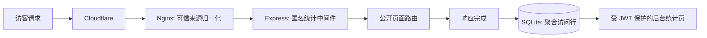

# 匿名服务器访问统计设计

## 0. 需求摘要

为 `blog.cokedaily.space` 的已登录管理员提供访问时间、匿名访客数、设备类别与页面访问量统计。采用用户选定的“服务器访问统计”范围：**不记录点击事件**，不保存原始 IP、完整 User-Agent、查询参数或 Referrer。

假设：统计保留 30 天，按北京时间小时展示；已识别自动化爬虫不计入统计。二者均可在 review 时调整。

## 1. 决策与约束

- 后台是唯一读取入口，沿用现有 JWT `authenticateToken` 保护。
- 原始客户端地址只在请求内用于生成每日轮换 HMAC；不得写入 SQLite、日志或 API 响应。
- Express 只信任本机 Nginx 代理；Nginx 必须将 Cloudflare 客户端地址安全归一化后再转发，不能相信客户端自行提交的 `X-Forwarded-For`。
- 面向访客的页脚增加简短的匿名统计说明；不增加 Cookie、前端 SDK、第三方分析服务或点击监听器。
- 当前 VPS 运行在 `d8c0896`，落后于远端 `master` 的 Node 24 / 密码与上传安全基线。上线本 feature 前，必须先将生产工作树升级到已验证的 `1832422` 基线，再部署本 feature。

明确不做：精确 IP 存储、单访客会话、完整 UA 保存、点击/滚动/表单追踪、广告或跨站跟踪、导出原始访问记录。

## 2. 现状与变化

### 2.1 名词层

**现状**：SQLite 只有 `users` 与 `articles` 业务表；`server/index.js` 在 Express 静态文件与前台路由之间注册中间件。Nginx 已转发 `X-Real-IP` 与 `X-Forwarded-For`，但尚未安全归一化 Cloudflare 的客户端地址。

**变化**：新增只承载聚合访问数据的 `access_metrics` 表：

- `bucket_utc`：按小时截断的 UTC 时间桶；后台以北京时间显示；
- `path`：去除 query string 的公开页面路径；
- `visitor_day_hmac`：`HMAC(secret, YYYY-MM-DD + client IP)`，每天轮换，不能跨日关联；
- `device_kind`：`desktop`、`mobile`、`tablet` 或 `other`；
- 不含 IP、完整 UA、Cookie、Referrer、用户名或点击数据。

管理员 API 仅返回时间段、总页面浏览、按日去重的匿名访客数、按小时/页面/设备的聚合结果，不返回事件行。

### 2.2 编排层

**现状**：公开页面直接由 Express 路由渲染；后台已有受 JWT 保护的文章管理页；Nginx 将所有动态请求代理至本机 Node `:3000`。

**变化**：请求中间件只对公开 `GET`/`HEAD` HTML 路由候选进行分类；在响应完成且状态为成功或重定向时异步写入一条最小数据记录。`/admin`、`/api`、`/images`、CSS/JS/WebP/ICO、非公开方法与已识别 bot 被排除。启动时和每日首次写入时清理超过保留期的数据。

Nginx 在仅信任 Cloudflare 官方 CIDR 的前提下处理 `CF-Connecting-IP`，并覆写传给 Node 的客户端地址头；Express 仅信任 loopback，避免伪造转发头影响匿名计数。

### 2.3 挂载点

- Nginx `blog.conf`：将可信客户端地址传给 Node；删除或禁用这一配置即可取消真实访问源参与匿名计数。
- Express 应用入口：统计中间件注册在静态文件和路由之前；删除它即停止采集。
- SQLite 初始化/迁移：访问指标表及索引；删除表即移除持久数据。
- 管理员路由与页面：统计 API、页面和导航入口；删除后无后台可见统计。
- 前台页脚：访问统计说明；删除后不再向访客说明该最小化收集范围。

### 2.4 推进策略

1. 对齐本地 `master` 与生产安全基线，并以 SQLite 备份作为部署回滚点。
2. 建立匿名数据模型、客户端地址信任链和保留清理，再做单元/集成验证。
3. 加入受保护的聚合 API 与极简后台页面，保持现有文章管理不变。
4. 部署 Nginx 与应用，使用直接源站和公开域名验证；检查数据库中没有原始 IP、UA、查询参数或点击数据。

### 2.5 结构健康度与微重构

- **文件级**：`server/index.js` 已承载公共路由与应用装配；统计中间件、设备分类和聚合查询应放入新的 analytics 模块，不继续堆入入口文件。`admin.js` 已承担文章 API，统计 API 应独立为 analytics 路由，避免混合职责。
- **目录级**：`server/routes/` 与 `server/middleware/` 已有明确归属，不做目录重组。
- **结论**：实现前做安全微重构：新建 analytics 中间件、数据访问和管理员路由/页面文件；入口文件只挂载它们。行为不变部分用现有文章和登录路径的 smoke test 验证。

## 3. 验收契约

- 公开文章页返回成功后，后台当天总浏览量增加；访问 `/admin`、`/api` 和静态资源不会增加。
- 同一客户端同一天访问多页时，页面浏览可累计，但匿名访客数按当天去重；跨日无法从后台关联为同一访客。
- 后台显示北京时间的小时趋势、页面分布和设备类别；未登录请求统计页面或 API 返回认证失败，不泄露数据。
- SQLite 表与后台响应中均不存在原始 IP、完整 UA、查询参数、Referrer、Cookie、点击事件或单访客明细。
- Cloudflare 与直连源站路径都不能通过伪造 `X-Forwarded-For` 影响匿名访客计数。
- 超过 30 天的数据被清理；站点页脚可见最小化统计说明。
- 生产升级后，现有首页、文章页、上传后台、文章后台、登录及 Nginx TLS 仍正常。

## 4. 风险、回滚与后续

- **地址信任链风险**：Cloudflare CIDR 配置错误会造成地址不可信或计数异常。上线前从 Cloudflare 官方 IP 列表生成配置，并用 `nginx -t` 与源站 Host 验证。
- **SQLite 写入风险**：统计写入不得阻塞页面渲染；数据库错误只记录受控服务端错误且不影响响应。部署前备份 `blog.db`，回滚应用和 Nginx 文件即可恢复。
- **数据保留风险**：30 天策略和每日 HMAC 缩短可关联窗口；如以后需要更短保留期，只更新配置并立即清理旧数据。
- **移除方式**：移除中间件、analytics 路由/页面、Nginx 地址传递配置与表，即可完整卸载该功能。
