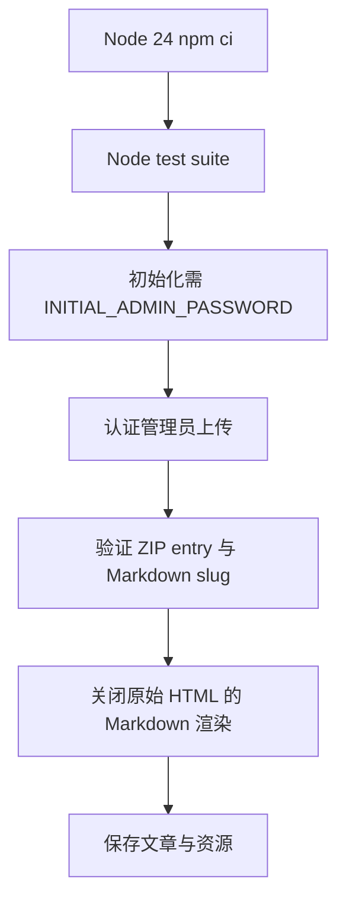

# Node 24 security baseline design

## 0. 范围与术语

### 用户目标

将 `gchigoo/Blog` 的生产运行时升级到 Node 24 LTS，升级与该运行时和安全修复直接相关的依赖，并修复架构审查确认的四项 P0 阻断：默认管理员凭证、Markdown 持久化 XSS、slug/ZIP 路径穿越、生产依赖漏洞。

### 已确认事实

- Node 官方 release schedule 显示 Node 24（Krypton）自 2025-10-28 起为 LTS；当前支持到 2028-04-30。
- 现有项目无 `engines`、`.nvmrc`、自动化测试或 CI；部署文档仍写 Node 18+。
- `npm audit --omit=dev` 当前为 4 high、4 moderate。
- `better-sqlite3@12.11.1` 明确支持 Node 24；`sharp@0.35.3` 要求 Node >=20.9。

### 术语

- **初始管理员密码**：仅在空数据库创建 `admin` 时使用的 `INITIAL_ADMIN_PASSWORD` 环境变量；不写入仓库、文档示例或默认值。
- **安全 slug**：仅 `[a-z0-9]` 与单个连字符组成、首尾均为字母数字的 slug。
- **安全归属路径**：`path.resolve` 后仍位于指定根目录内的路径。
- **文章 HTML**：由受限 Markdown 渲染器生成并存进 SQLite 的正文 HTML；不接受文章中的原始 HTML。

### 明确不做

- 不实施 P1 的登录限流、CSRF、HTTPS/Nginx 加固、ZIP bomb 配额、备份重构、健康检查或优雅关闭。
- 不拆 route/service/repository，不加入队列、Redis、ORM 或新的数据库。
- 不迁移既有文章内容；已存储 HTML 的再清洗留作后续数据迁移任务。
- 不将 EJS 从 3.x 升到 6.x：这不是 Node 24 或已确认 P0 的必要条件，属于未经验证的模板引擎大版本迁移。

### 复杂度档位

默认单实例个人博客档位；安全边界必须可自动回归验证。

## 1. 决策与约束

### 决策 A：运行时和依赖采用“安全/兼容聚焦升级”

更新 `package.json`、锁文件、`.nvmrc`、`engines.node` 和部署文档，使其统一声明 `>=24 <25`。更新与 Node 24 原生 ABI 或已发现审计漏洞直接相关的依赖至当前稳定兼容版本：包括 `better-sqlite3`、`sharp`、`multer`、`adm-zip`、`markdown-it`、`markdown-it-anchor`、`express`、`slugify` 与 `nodemon`；保留未被此范围要求升级的 `ejs@3` 和其他稳定直接依赖。

理由：既能获取 Node 24 原生预编译支持并清除可修复审计链，又避免把 EJS 6 等无关 major upgrade 混入安全修复。

### 决策 B：用 Node 内建 `node:test` 建立最小回归门

不额外引入测试框架。新增 `npm test`，以 Node 24 的内建 test runner 验证纯函数、子进程初始化和 Express 路由行为。

理由：依赖最少，适合当前 CommonJS 小型服务；每个 P0 修复必须先有失败测试再改生产代码。

### 决策 C：拒绝而非修复不安全输入

自定义 slug 不符合安全格式时返回 400；ZIP 中存在不安全条目时整体拒绝，不做“静默重写路径”。原始 Markdown HTML 一律按文本处理。

理由：安全策略可预测，避免发布者不知道内容被服务器隐式改写。

## 2. 现状 → 变化

### 2.1 运行时与发布契约

**现状**：`package.json` 没有 `engines` 或测试命令；`DEPLOY.md` 要求 Node 18+ 并建议 `npm install`；没有 `.nvmrc`。原生包版本为 `better-sqlite3 ^11.8.1`、`sharp ^0.33.5`。

**变化**：仓库以 Node 24 为唯一支持的生产 major；`npm ci` 取代部署中的非确定性 `npm install`；锁文件只在 Node 24 环境重新生成。README/DEPLOY 不再描述默认管理员密码，而说明通过受保护的环境变量初始化。

### 2.2 管理员初始化与改密

**现状**：`server/scripts/init-db.js` 在空数据库固定插入 `admin/admin123`；`scripts/change-password.js` 的 CLI 参数路径绕过交互模式长度检查。

**变化**：空数据库初始化必须读取非空的 `INITIAL_ADMIN_PASSWORD`，且通过统一的密码规则；缺失或弱密码会失败且不创建管理员。改密脚本无论参数或交互输入都使用同一验证函数。密码不会输出到日志。

**示例**：

```text
INITIAL_ADMIN_PASSWORD=<strong secret> npm run init-db  -> 创建 admin
npm run init-db（空数据库且变量缺失）                 -> 非零退出，不创建 admin
```

### 2.3 Markdown 与管理端显示

**现状**：`server/utils/markdown.js` 的 `MarkdownIt({ html: true })` 保留原始 HTML，`views/article.ejs` 以 `<%- article.html %>` 输出。后台模板还将文章标题进入 DOM/内联 JavaScript 上下文。

**变化**：Markdown 渲染器关闭原始 HTML；文章 HTML 仍可由 Markdown 语法（含普通图片）生成。后台文章标题只进入 EJS 转义文本上下文或由前端 `textContent` 写入；删除动作使用元素 ID/data attribute 和事件监听，不将标题/slug 拼进 HTML 或 `onclick`。

**示例**：

```text
输入：\n\n# 标题
输出文章 HTML：不含可执行 img 标签或 onerror 属性
```

### 2.4 上传文件边界

**现状**：Front Matter 自带 `slug` 会直接被 `path.join(articlesDir, slug + '.md')` 使用；ZIP 解压后再次按原始 `entry.entryName` 拼接读取路径。

**变化**：在保存、查重和删除前验证 slug；对每个 ZIP entry 在解压前验证路径语义，并只通过安全归属路径读取。所有文章 Markdown 的读写删除都由同一个路径解析 helper 计算。

**示例**：

```text
slug: ../README             -> 400，README 哈希不变
ZIP entry: ../../outside.md -> 400，extractDir 外部文件不被读取
ZIP entry: article.md       -> 正常继续上传流程
```

### 2.5 结构健康度与微重构

`server/routes/admin.js` 已承担上传解析、图片处理、持久化与清理；本次只新增小型纯工具模块（密码策略、上传路径验证）以便测试，避免继续堆叠安全判断。不会改变路由职责或调用图；route/service 分层重构超出本次范围。

## 2.6 主流程



## 2.7 挂载点

1. `package.json`、`.nvmrc`、lockfile 与部署文档：固定 Node 24 与依赖图。
2. `init-db` 和 `change-password`：移除默认凭证、统一密码规则。
3. Markdown renderer 与 article/admin views：防止上传文章和标题成为执行脚本的载体。
4. admin upload/delete 路由：只操作文章目录内的受验证路径。
5. `test/` 与 `npm test`：将四项安全行为变为可重复门禁。

## 3. 验收契约

| 场景 | 期望可观察结果 |
|---|---|
| Node 24 干净安装 | `node -v` 为 24.x，`npm ci`、原生依赖加载、初始化和启动均成功 |
| 空 DB 未设初始密码 | `npm run init-db` 非零退出，数据库中没有默认 admin |
| 空 DB 设强初始密码 | 初始化成功；密码可 bcrypt 验证；输出不含明文密码 |
| 改密 CLI 提供弱密码 | 非零退出，hash 不改变 |
| Markdown 含 script/onerror/raw HTML | 渲染 HTML 不出现可执行标签/属性；正常 Markdown 图片仍存在 |
| 恶意 slug | 上传返回 400；`articles/` 外目标文件哈希不变 |
| ZIP 含 traversal/absolute path | 上传返回 400，解压目录外文件不被读取或写入 |
| 正常 md/ZIP | 现有两篇文章包仍可上传，图片引用可继续转为 WebP |
| 审计 | `npm audit --omit=dev` 的 high 与 critical 均为 0；剩余 moderate 必须列明来源与不可自动修复理由 |
| 回归 | `npm test`、`node --check`、目标 Node 24 的 HTTP smoke test 通过 |

## 4. 推进策略

1. **运行时契约与测试基座**：先加入 Node 24 声明、测试命令和失败的安全测试；退出信号是测试能因现有不安全行为正确失败。
2. **输入边界**：实现密码策略、slug/ZIP 路径 helper；退出信号是攻击输入被拒绝且正常输入保留。
3. **渲染与管理端安全输出**：关闭 Markdown 原始 HTML，移除标题拼接到危险 DOM/JS 上下文；退出信号是 XSS 测试通过。
4. **依赖升级与锁定**：在 Node 24 下升级指定直接依赖、重建 lockfile；退出信号是 audit high/critical 为零。
5. **发布验证与文档**：更新 README/DEPLOY、干净 Node 24 安装、两篇文章包 smoke test；退出信号是发布手册不再含默认凭证或 Node 18 基线。

## 5. 风险与回滚

- 原始 HTML 将从新上传文章中变为文本：这是刻意的安全行为变化。若历史文章依赖 HTML，需另开“历史内容迁移”任务，不能在本修复中悄悄放宽过滤。
- `better-sqlite3` / `sharp` major 版本升级可能影响预编译二进制和图片输出，必须在 Ubuntu Node 24 做干净安装验证。
- 任何失败可用对应 scoped Git commit `git revert <sha>` 回滚；运行时部署在 VPS 改造前先备份 `blog.db`、`articles/` 与 `public/images/`。
