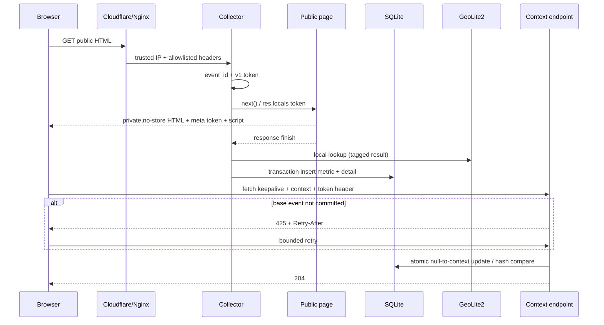

# 访客访问明细与设备上下文设计

## 0. 术语约定

| 术语 | 定义 | 契约 |
|---|---|---|
| 聚合指标 | 现有 `access_metrics` 中的页面浏览、每日访客、小时、页面与设备类别统计 | 保留现有 API 口径 |
| 访问事件 | 一次成功公开 HTML 页面访问的服务端明细 | 由唯一 `event_id` 对外标识 |
| 可信客户端地址 | 经 Cloudflare CIDR、Nginx real-ip 与 Express `trust proxy=loopback` 归一化后的 `req.ip` | 不信任客户端任意转发头 |
| 服务端客户端信息 | 原始 User-Agent、允许的 Client Hints、Accept-Language 及解析结果 | JavaScript 关闭时仍可记录 |
| 浏览器设备上下文 | 第一方脚本补充的高熵 Client Hints、屏幕、视口、语言、时区、CPU、内存、触控和网络能力 | 浏览器不提供的字段为 `null`，内容可被客户端伪造 |
| 近似地区 | 本地 GeoLite2 City 根据可信 IP 返回的洲、国家、一级行政区、城市、邮编、时区、坐标及精度半径 | 网络出口近似值，不是 GPS |
| 事件上下文令牌 | 绑定版本、audience、`event_id` 与过期时间的短期 HMAC 令牌 | 只授权补充单个事件，不是身份 Cookie |
| 旧聚合行 | 升级前仅存在于 `access_metrics`、没有明细侧表的行 | 只参与 overview，不进入事件列表 |
| 原始路径 / 展示路径 | 原始路径是数据库与 API 兼容字段中的 percent-encoded path；展示路径是只在 view model 中为全部路径统一生成的 Unicode 可读文本 | 不按标签或路由做特例，不改写历史数据或聚合 identity；例如 `/tag/%E5%B7%A5%E5%85%B7` 显示为 `/tag/工具` |

## 1. 决策与约束

### 1.1 需求摘要与范围

管理员需要查看每一次公开页面访问的时间、原始 IP、公开 URL、来源、地区、设备、系统、浏览器及版本；浏览器支持时，还要看到屏幕、视口、语言、时区、CPU、内存、触控、网络能力和高熵 Client Hints。

owner 于 2026-07-16 明确决定：**允许记录原始 IP、完整设备信息和访客访问明细，不要求对这些分析字段做掩码或匿名化。** 新 requirement `.codestable/requirements/detailed-visitor-analytics.md` 已建立；旧 `.codestable/requirements/anonymous-access-analytics.md` 标为 `outdated`，仅保留历史记录。

成功标准：

- 每个成功公开 HTML 页面请求产生一条可查询访问事件；
- 管理员可按日期、完整 IP、公开路径、来源域、国家/一级行政区/城市、设备、OS、浏览器筛选并查看详情；
- 浏览器支持时，短期补充同一事件的完整设备上下文；不支持或 JavaScript 关闭时稳定降级；
- 现有 pageViews、anonymousVisitors、byHour、byPage、byDevice 保持兼容；
- 后台 overview、事件列表和详情把所有合法 UTF-8 percent-encoded 路径显示为可读 Unicode，不按 `/tag/工具`、标签名或路由建立特例/白名单，同时保留原始编码路径供核对；
- GeoIP/UA 解析、上下文补充或 analytics SQLite 写入失败都不改变公开页面响应；
- OAuth 凭据、Cookie、Authorization、事件令牌和管理员 JWT 永不进入 analytics 事件库、管理员 analytics API raw 响应或 analytics 模块应用日志。

明确不做：

- 不采集点击、滚动、表单输入、键盘内容、页面正文或评论内容；
- 不引入第三方分析 SDK，不在请求路径调用在线 IP 定位；
- 不创建长期 `visitor_id`/session Cookie，不做跨 IP 身份识别；
- 不做实时在线人数、告警、热力图、地图或 CSV/Excel 导出；
- 不猜测浏览器未提供的精确硬件型号。

### 1.2 复杂度档位

- 健壮性 = L3：原始头、URL、GeoIP 文件、公开 JSON 和管理员筛选均需严格边界与稳定错误语义。
- 安全性 = validated：允许明文保存分析字段，但必须防 OAuth 泄漏、越权补充、DoS、存储型 XSS 和代理头伪造。
- 可测试性 = verified：信任链、事件写入、token/幂等、重试、解析降级、清理、查询计划、认证和安全渲染均有证据。
- 可观测性 = logged：只记录 `event_id`、错误类别和状态；不记录 token、密钥、JWT、凭据值或完整 context。
- 性能 = reasonable：请求时仅本地 MMDB/解析/SQLite；列表 cursor 分页；100k fixture 验证索引与预算。

### 1.3 核心架构决策

1. **保留聚合表，新增一对一明细侧表。** `access_metrics` 维持兼容；`access_event_details.metric_id` 唯一关联聚合行。旧行没有明细合法，但仅出现在 overview。
2. **事件身份与 API 身份分离。** `access_event_details.event_id TEXT UNIQUE NOT NULL` 使用 `randomBytes(16)` 的 32 位小写十六进制；管理员 API 的 `id` 始终指 `event_id`，`metric_id` 只用于内部关联和 cursor tie-breaker。
3. **明文保存 owner 允许的分析字段。** 原始 IP、UA、公开 URL/查询、Referrer、请求 Client Hints 和浏览器 context 明文保存；Cookie、Authorization、OAuth/凭据参数值无论隐私选择如何都禁止保存。
4. **地区使用本地 `@maxmind/geoip2-node` 7.x + GeoLite2 City。** 应用异步启动时动态导入 ESM 包并从完整 Buffer 打开本地 MMDB；请求时无远程 I/O。统一保存英文 locale 名称及 ISO/code，界面可另行本地化。生产主机通过独立 systemd timer 每周更新一次 MMDB，应用自持 reload poller 先验证候选库再交换 reader，不依赖第三方内建 watcher 的错误/关闭语义，也不把 MaxMind 凭据交给 Node 进程。
5. **客户端解析使用 `bowser` 2.14.x。** 保存原始输入，同时解析浏览器/版本、OS/版本、引擎、设备类别/厂商/型号；实际版本由 lockfile 固定并通过 audit。
6. **第一方脚本补充服务端看不到的信息。** 收集 `navigator.userAgentData.getHighEntropyValues()` 实际返回值、screen/viewport、devicePixelRatio、语言、时区、hardwareConcurrency、deviceMemory、maxTouchPoints 和 Network Information API 可用字段；不做交互监听。
7. **两阶段写入使用有版本的短期令牌和确定性幂等。** wire format 为 `v1.<base64url(canonicalClaims)>.<base64url(signature)>`；claims 固定 `{v:1,aud:"analytics-client-context",eventId,iat,exp}`。`signingKey = HKDF-SHA256(secretBytes, salt="minimalist-blog/analytics", info="analytics-client-context/v1", length=32)`，signature 为 `HMAC-SHA256(signingKey, ASCII("v1." + payloadSegment))` 的 unpadded base64url；验证使用 `timingSafeEqual`。TTL 固定 600 秒，并以固定 token fixture 验证跨实现可复现。
8. **上下文规范化后再判定幂等。** 只保留 allowlist 字段，类型/范围校验后按 Unicode scalar/string 及递归排序 key 生成 canonical JSON，计算 SHA-256 `context_hash`。事务执行 `UPDATE ... WHERE context_collected_at IS NULL`；更新 0 行时，同 hash 返回 204，不同 hash 返回 409。
9. **使用有界 425 重试处理 response-finish 竞态。** 基础事件不存在但 token 有效时返回 `425 event_not_ready` 与 `Retry-After: 1`。客户端最多 5 次：立即、1、2、4、8 秒；只对 425 重试，遵守不小于 `Retry-After` 的延迟，其他状态或 token 过期立即停止。
10. **公开补充路由在全局 JSON parser 之前挂载。** 顺序固定为：精确路径/POST → Content-Type → Origin → pre-auth IP 限流 → token header 语法与签名 → event 限流 → Content-Length 快速检查 → 路由级 `express.json({limit:'16kb',strict:true,type:'application/json'})` → schema/写入。chunked body 也由 parser 的实际字节上限保护；Nginx 精确 location 同时设置 `client_max_body_size 16k`，避免明显超限请求占用通用 50 MiB 代理缓冲边界。Nginx 拒绝时只保证 HTTP 413，直达应用时才保证 JSON `payload_too_large`。
11. **公开 HTML 必须私有且不可缓存。** 任何含 event token 的被跟踪 HTML 设置 `Cache-Control: private, no-store`；Nginx/Cloudflare 不得覆盖为共享缓存。管理员 HTML/API 继续 `no-store`。
12. **原始值按纯文本呈现。** 任意 raw/不可信值只能经 EJS `<%=` 或 DOM `textContent` 输出；禁止把不可信值传给 `<%-`、`innerHTML` 或 raw JSON `<script>`。现有 `<%- include(...) %>` 仅可用于静态、受信模板 include。URL/Referrer 默认显示为不可点击文本；若以后可点击，仅允许解析后 `http:`/`https:`。
13. **所有事件字段统一保留。** `ANALYTICS_RETENTION_DAYS` 默认 30，范围 1–365；schema 完成后启动清理一次，随后每 6 小时清理一次。删除聚合行时明细级联删除。
14. **管理员查询只返回有明细的事件。** overview 继续包含旧聚合行；事件 list/detail 只查询 `access_event_details`，不制造旧数据的时间、IP 或设备占位事件。
15. **解析失败不丢基础事件。** GeoIP 与 Bowser adapter 都返回 tagged result；失败分别保存 `geo_status=lookup_error`、`client_parse_status=error` 和空结构化字段。只有基础 SQLite 事务失败时该 analytics 事件可丢失，页面响应仍不受影响。
16. **不新增长期访客标识。** 跨事件分析只能按原始 IP、UA、地区和现有每日 HMAC；回访用户或 session 漏斗另起 feature。
17. **路径存储与展示分离。** `access_metrics.path` 与 `access_event_details.request_path` 继续保存原始 percent-encoded 值，保证旧聚合/API/filter identity 不变；共享 pure helper `formatAnalyticsPath(rawPath)` 对 overview、事件列表和事件详情中的**全部路径**统一生成 `{displayPath,displayPathStatus}` view model，不写回 DB，不按 `/tag/工具`、标签名或路由建立特例/白名单。实现使用 `decodeURI` 而不是 `decodeURIComponent`，因此 `%2F/%3F/%23` 等保留为编码分隔符。helper 顺序固定为：尝试 `decodeURI` → 失败则选择原始字符串并标记 `raw_invalid_encoding` → 对选中的 display candidate 做 NFC normalize → 无论解码成功或 fallback，都把 Unicode `Cc/Cf` 控制/格式字符转换成可见 `\u{...}`。因此非法 percent 与原始 bidi/control 的组合也不能把不可见控制符带进 UI；`path/requestPath` 原值始终逐字不变。所有展示仍走 EJS `<%=`/DOM `textContent`，编码后的 `<script>` 只能显示为文字。

| raw path | displayPath | status |
|---|---|---|
| `/tag/%E5%B7%A5%E5%85%B7` | `/tag/工具` | `decoded` |
| `/tag/%E7%BC%96%E7%A8%8B` | `/tag/编程` | `decoded` |
| `/tag/%E6%95%88%E7%8E%87%E5%B7%A5%E5%85%B7` | `/tag/效率工具` | `decoded` |
| `/emoji/%F0%9F%9A%80` | `/emoji/🚀` | `decoded` |
| `/x/%2F/%3F/%23` | `/x/%2F/%3F/%23` | `raw` |
| `/bad/%E5%A` | `/bad/%E5%A` | `raw_invalid_encoding` |
| `/x/%3Cscript%3E` | `/x/<script>`（纯文本） | `decoded` |

### 1.4 配置与生命周期契约

| 配置 | 默认/范围 | 启动行为 |
|---|---|---|
| `ANALYTICS_DETAILS_ENABLED` | `false`，仅接受 `true/false` | `false` 时保留旧 overview，不挂 token/script/context/event API；生产发布需显式设 `true` |
| `ANALYTICS_HMAC_SECRET` | 无默认；canonical unpadded base64url，解码后至少 32 bytes | 只接受 `[A-Za-z0-9_-]+`、无 `=`，解码再编码必须完全相等；无论 details 是否启用都在监听前 fail-fast；部署用 `randomBytes(32).toString('base64url')` 生成 |
| `ANALYTICS_RETENTION_DAYS` | `30`，整数 1–365 | 非法值监听前失败 |
| `ANALYTICS_GEOIP_CITY_DB_PATH` | details 启用时必填 | 必须可读且 metadata `databaseType` 为 City；缺失、损坏或类型错误监听前失败 |
| `ANALYTICS_GEOIP_UPDATE_STATUS_PATH` | 默认取 City DB 同目录的 `update-status.json`；生产解析为 `/var/lib/blog/geoip/update-status.json` | status 缺失/损坏不阻止启动或 lookup，按明确 degraded 状态暴露给管理员 |
| `ANALYTICS_PUBLIC_ORIGIN` | details 启用时必填，绝对 `http/https` origin | 用于构造 canonical `full_url` 和校验 Origin；生产必须为 HTTPS，不信任请求 Host |
| context TTL/body | 固定 600 秒 / 16384 bytes | 本期不开放环境变量，避免部署漂移 |

`GeoResolver` 自持 `{reader, fingerprint, datasetEpoch}`。启动时把 live MMDB 完整读入 Buffer，用 `Reader.openBuffer()` 验证 City metadata 后建立首个 reader；details 启用但首个 reader 无法建立时监听前失败。运行中每 60 秒用 `unref()` poller 检查 live 文件的 `dev+ino+size+mtimeMs`：

1. fingerprint 未变化直接返回；变化时若已有 reload in-flight，不并发启动第二次；
2. 把候选文件完整读入新 Buffer，创建独立 candidate reader，验证 `databaseType=City`、build epoch 合法并执行固定 IP fixture lookup；
3. 全部成功后用单次引用赋值交换 current reader/fingerprint/dataset epoch；每次 lookup 先捕获 current reader 局部引用，因此在途查询继续用旧 reader，新查询立即用新 reader；
4. 读取、解析或校验失败时丢弃 candidate，保留 current reader。相同失败 fingerprint 每 5 分钟最多重试/记录一次，文件再次变化可立即重试；
5. `lifecycle.stop()` 清 60 秒 poller、6 小时清理 timer、限流 timer/Map 并清空 current reader 引用。Buffer reader 没有外部 watcher/file handle，不假定第三方 `close()` API。

成功重载后更新内存 metadata/dataset date；失败事件只记录 fingerprint 与错误类别，不记录路径中的凭据或 MMDB 内容。bootstrap 为 SIGTERM/SIGINT 注册一次性 shutdown，先停止接收新请求，再调用 `lifecycle.stop()` 和关闭 DB。

`GeoResolver.getStatus()` 返回只读 snapshot：

```text
{
  reader: { datasetEpoch, datasetDate, fingerprint, lastReloadAt, reloadStatus },
  updater: {
    state: ok | missing | corrupt | unreadable,
    lastAttemptAt, lastSuccessAt,
    result: bootstrap | updated | no-op | failed | unknown,
    errorCategory, datasetEpoch
  },
  stale
}
```

同一个 60 秒 poller 读取 status path：先 `lstat`，只接受非 symlink 的普通文件、最大 4 KiB；JSON 必须严格符合 allowlist schema、RFC3339 timestamps、result/error enum 和有限 epoch。成功时替换内存 status snapshot；missing/corrupt/unreadable 时返回对应 state、`result=unknown`，保留 reader snapshot，不影响 lookup/公开请求。`stale` 精确定义为 current reader `datasetEpoch` 距当前时钟超过 14×24 小时；最近 updater 失败另外显示失败类别，不擅自改写 stale。管理员 overview API/page 只读该内存 snapshot，不在请求路径同步读文件。

#### GeoLite2 City 每周更新契约

- 本运维面明确为 **Linux + systemd only**；Windows 本地开发使用 fixture/manual DB，不尝试模拟 systemd。交付 `deploy/systemd/blog-geoip-update.service`、`deploy/systemd/blog-geoip-update.timer`、`scripts/update-geoip.sh` 和 `scripts/verify-geoip-db.js`。
- timer 固定为服务器本地时区每周日 03:30，`RandomizedDelaySec=30m`、`AccuracySec=5m`、`Persistent=true`；服务器关机错过后，在下次启动时补跑一次。
- timer 核心配置固定为：`OnCalendar=Sun *-*-* 03:30:00`、`RandomizedDelaySec=30m`、`AccuracySec=5m`、`Persistent=true`、`Unit=blog-geoip-update.service`，并通过 `WantedBy=timers.target` 启用。
- canonical production paths 固定为：项目 `/root/Blog`，live `/var/lib/blog/geoip/GeoLite2-City.mmdb`，previous `/var/lib/blog/geoip/GeoLite2-City.mmdb.previous`，staging root `/var/lib/blog/geoip/staging`，status `/var/lib/blog/geoip/update-status.json`，lock `/run/blog-geoip-update/update.lock`。生产 `ANALYTICS_GEOIP_CITY_DB_PATH` 必须等于 live path，部署脚本逐项校验。
- one-shot service 以 root 运行，`WorkingDirectory=/root/Blog`，执行部署时校验为 `root:root 0755` 的 wrapper；systemd 用 `RuntimeDirectory=blog-geoip-update` 创建专用运行目录。wrapper 用 `exec 9>/run/blog-geoip-update/update.lock` 后执行 `flock --nonblock 9`，FD 9 保持到整个 wrapper 退出；锁忙时以 exit 75 和 `already_running` 类别立即退出，不无限等待。
- unit 设置 `UMask=0022`、`NoNewPrivileges=true`、`PrivateTmp=true`、`ProtectHome=read-only`、`ProtectSystem=strict`、`RestrictSUIDSGID=true`，只通过 `ReadWritePaths=/var/lib/blog/geoip /run/blog-geoip-update` 开放写入。`/var/lib/blog/geoip` 为 `root:root 0755`，live/previous/status 为 `root:root 0644`，每次 promote 后断言 Node 运行用户可读。
- MaxMind 配置固定为 root-owned `0600 /etc/GeoIP.conf`，`EditionIDs GeoLite2-City`；Account ID/License Key 不放环境变量、仓库、命令行或日志。wrapper 使用官方 `geoipupdate -f /etc/GeoIP.conf -d <unique-staging-dir>` 把下载限制在同盘 staging。
- 每次运行创建同盘 `0700 staging/run-*` 并注册退出清理。候选必须存在；`scripts/verify-geoip-db.js` 用与应用相同的 Buffer reader 验证 City metadata、build epoch 和固定 lookup，并输出不含凭据的 `{sha256,datasetEpoch}`。
- bootstrap：live 不存在是首次安装的合法分支。候选验证成功后设置 `0644`、fsync，并以同盘单次 rename 安装为 live、fsync parent；previous 缺席合法，status=result:bootstrap。任何失败都保持 live 不存在并返回非零，不产生半文件。
- no-op：live 已存在且候选 sha256/dataset epoch 与 live 相同则不改 live/previous，写原子 status 后 exit 0。
- promote：任何下载/验证失败都不触碰 live。live 已存在且候选有效并不同时，先把当前 live 复制为 `previous.tmp`，设置 `0644`、fsync 文件，再 atomic rename 为 previous 并 fsync parent；随后设置候选 `0644`、fsync，使用同盘单次 rename 原子替换 live，再 fsync parent。任一步失败按阶段返回非零并清 staging；promote 前失败保证 live 未移动，promote 后 live 必为完整已验证文件。
- rollback：`scripts/update-geoip.sh --rollback` 在同一 nonblocking lock 下先验证 previous，再复制为 `rollback.tmp`、fsync，并 atomic rename 替换 live，保留 previous；失败不触碰 live。
- status：每次 attempt 以 atomic write 更新无敏感信息的 `update-status.json`，字段为 `lastAttemptAt,lastSuccessAt,result,errorCategory,datasetEpoch`。管理员 analytics 页面显示 current dataset date、last success/failure；dataset epoch 超过 14 天显示 stale，但不阻止事件写入。
- 应用 poller 最迟 60 秒观察 atomic replacement 并走 candidate-open/validate/swap；损坏或 I/O 失败 fixture 必须证明旧 reader 继续可查询，进程不中断。
- 首次部署顺序固定为：安装依赖/脚本/units → 创建 canonical dirs/modes → 写入 `/etc/GeoIP.conf` → 手动启动 updater 完成 bootstrap → 用 verifier/权限断言确认 live → 设置 analytics env paths/details=true → 启动应用 → `enable --now` weekly timer。bootstrap 失败时不得启用 details 或启动应用；修复凭据/网络后重跑同一 service，无人工复制 MMDB 旁路。
- 运维命令必须可执行：`systemctl enable --now blog-geoip-update.timer`、`systemctl list-timers blog-geoip-update.timer`、`systemctl start blog-geoip-update.service`、`systemctl status blog-geoip-update.service`、`journalctl -u blog-geoip-update.service`。日志不得包含 Account ID、License Key 或完整配置。

##### GeoIP updater evidence matrix

| Scenario | 前置/动作 | 必须断言 | Evidence file |
|---|---|---|---|
| timer | install 后 enable/start；读取 unit/show/list-timers | enabled+active；OnCalendar/jitter/accuracy/Persistent 与 design 相同；NextElapse 存在 | `artifacts/geoip/timer-status.txt` |
| bootstrap | live/previous/status 均不存在；手动 start service | exit 0；仅创建完整 valid live+status，previous 缺席合法；mode/path/epoch/verifier 通过；随后 app 可启动 | `artifacts/geoip/bootstrap.json` |
| missed-run | Linux systemd test VM 临时停用 timer 跨过触发点后启动 | Persistent 只补跑一次，attempt time 更新 | `artifacts/geoip/missed-run.txt` |
| success | 记录 live/previous checksum+epoch；手动 start service | exit 0；live epoch/hash 变更或合法 no-op；权限正确；60秒内 app current epoch 更新且 lookup 成功 | `artifacts/geoip/update-success.json` |
| no-op | 用与 live 同 hash/epoch 的 candidate fixture 执行 test-root wrapper | exit 0；live/previous checksum 不变；status=result:no-op | `artifacts/geoip/update-noop.json` |
| lock | 预占 lock 后启动 wrapper | exit 75；journal=already_running；live/previous/status 内容不被 promote 改写 | `artifacts/geoip/update-lock.json` |
| invalid candidate | test-root 注入损坏/非 City MMDB | 非零 verify exit；live/previous checksum 不变；staging 清理；status failure 无 secret | `artifacts/geoip/update-invalid.json` |
| promote failure | test-root 在 prepare-previous 与 promote-live 阶段分别注入 I/O failure | live 始终为旧完整或新完整文件，无缺失窗口；exit/errorCategory 确定 | `artifacts/geoip/update-promote-failure.json` |
| reload failure | app test 替换为损坏/不可读 fingerprint | current reader/epoch 不变，旧 reader lookup 成功，日志同 fingerprint 5分钟限频 | `artifacts/geoip/reload-failure.json` |
| rollback | valid previous 存在；执行 `--rollback` | exit 0；live atomic 变回 previous epoch；previous 保留；60秒内 app reload | `artifacts/geoip/rollback.json` |
| secrets | 用唯一 canary credential 跑 success/failure，检查 journal/artifacts/process args | canary 在所有输出中 0 命中 | `artifacts/geoip/secret-scan.txt` |
| status consumer | valid/missing/corrupt/symlink/oversize/unreadable status fixtures；推进 fake clock | `getStatus()`/overview 返回对应 state；reader lookup 不受影响；14天边界 stale 精确；request path 不读文件 | `artifacts/geoip/status-provider.json` |

Linux CI/QA 使用临时 test root、fake `geoipupdate` 和小型合法/损坏 MMDB fixtures 执行状态机；Windows `npm test` 明确 skip systemd/shell integration，但仍运行 `GeoResolver` candidate swap/failure 单元测试。S7 的 Linux systemd smoke 是 release blocking，不得被 Windows skip 替代。

### 1.5 采集与安全边界

- 采集范围：公开 `GET/HEAD`、最终状态 2xx/3xx、Content-Type 为 HTML 的页面。
- 永久排除：`/auth`（含 `/auth/google` 与 `/auth/google/callback`）、`/admin`、`/api`、静态资源、bot、4xx/5xx。OAuth 成功/失败回调均不得创建事件。
- URL：以 `ANALYTICS_PUBLIC_ORIGIN` 加规范化 `req.originalUrl` 构造；不读取 Host。保留公开查询结构，但对大小写不敏感的 `code,state,token,access_token,id_token,refresh_token,password,secret,api_key,apikey,authorization,credential` 参数只保存 `[REDACTED]`。若公开 query 无法安全解析，则只保存 `request_path`，`query_string=null`，`full_url=origin+path`，并标记 `invalid_query_redacted`，绝不回退保存原始 query。
- Referrer：只接受成功解析的 `http/https` URL，清除 URL userinfo，并对上述凭据参数脱敏；解析失败、非 HTTP(S) 或 userinfo 异常时保存 `referrer=null/referrer_host=null` 与状态，不保存截断原文。
- Header：仅保存 User-Agent、Accept-Language 和显式 allowlist 的 `Sec-CH-UA*`；Cookie、Authorization、Proxy-Authorization、Set-Cookie 永不复制到事件对象。
- 长度：UA 2 KiB、Referrer/full URL 4 KiB、单个 Client Hint 1 KiB、请求 hints JSON 8 KiB、browser context body 16 KiB；超限字段截断并记录 `*_truncated`，公开 JSON body 超限直接 413。
- 同源：context POST 必须带与 `ANALYTICS_PUBLIC_ORIGIN` 完全一致的 `Origin`，否则 403；不使用管理员 Cookie/JWT。
- 限流：验签前先按可信 IP 使用每分钟 30、burst 10 的进程内 token bucket，避免无效签名洪泛；验签后再按 `event_id` 每 10 分钟最多 8 次。IP entry 空闲 10 分钟到期、最多 4096 条；event entry 在 token `exp+60s` 到期、最多 8192 条。每分钟惰性+定时回收；分配前先清 expired，仍满则对新 key fail-closed 返回 429，不驱逐活跃 entry。回收 timer `unref()`，`lifecycle.stop()` 清 timer 并清空 Map。当前单 Node 进程足够；若未来多实例，限流状态迁到 Redis 或 Nginx shared zone。
- 存储型 XSS：所有原始字段都按不可信文本处理。安全测试必须包含 `</script>`、事件属性、`javascript:` URL 和恶意 JSON key，验证页面 DOM 不产生可执行节点。

### 1.6 风险、依赖与基线

**Top 风险与缓解**

1. 地址信任链错误：复用 Cloudflare real-ip snippet，覆盖 CDN、源站、IPv4/IPv6 和伪造转发头测试，生产以真实请求核对。
2. 两阶段上报伪造/竞态：128-bit id、version/audience/domain-separated HMAC、10 分钟 TTL、Origin、限流、425 有界重试、canonical hash 与原子更新。
3. 原始字段造成存储型 XSS：只允许 text-only 渲染，恶意 fixture 做 DOM/HTML 断言。
4. SQLite 明细增长：30 天默认保留、cursor、目标索引、raw 字段不进列表、100k fixture 查询计划与预算。

**依赖与运维**

- 新增 `@maxmind/geoip2-node` 7.x（Apache-2.0、ESM、Node >=22）和 `bowser` 2.14.x（MIT、CommonJS）；当前 Node 24 满足约束。
- 主机安装 `geoipupdate` 并启用 `blog-geoip-update.timer`；GeoLite2 City 每周日更新，MMDB 和凭据不提交仓库。
- Nginx 必须持续维护 Cloudflare CIDR real-ip snippet；默认基础设施 access/error log 与 Cloudflare log 可按 owner 决策保留原始 IP、请求 URI 和 Referrer，不属于 analytics event store/统一保留期。本设计中的“凭据不得进入日志”仅约束新增 analytics 模块应用日志；若要另行收紧既有代理/CDN 日志格式与保留，单独走安全 hardening 变更。
- details 启用会让被跟踪 HTML `private, no-store`，这是防止 event token 被共享复用的必要代价。

**设计基线（2026-07-16）**

- `HEAD=38b41939a6656b0b55e6fc935ed85719c6304fe0`；Google comments/OAuth 已在基线内，属于必须保护的非回归路径。
- `node --test test/analytics*.test.js`：3/3 passed；`npm test`：51/51 passed；`npm audit --omit=dev --audit-level=high`：0 vulnerabilities（实施时以重新执行输出为准）。
- 工作区存在 CodeStable reference/runtime 等 ambient changes；实施与提交只纳入本 feature 明确文件。

## 2. 名词与编排

### 2.0 现状代码事实

- `server/analytics/middleware.js` 当前只对成功 GET/HEAD 记录 `req.ip`、UA 推导的四类设备和每日 HMAC；排除 `/admin`、`/api`、图片/静态扩展和已识别 bot，但尚未排除 `/auth`。
- `server/analytics/store.js` 的 `access_metrics` 实际是一行一次访问，只含小时桶、path、每日 HMAC 和 device kind；保留期固定 30 天且依赖新流量触发清理。
- `server/routes/analytics.js` 和 `views/admin/analytics.ejs` 只有 1/7/30 天 overview，页面仍声明匿名且不保存原始 IP/完整设备。
- 当前 `getOverview().byPage` 直接返回并由 EJS 显示数据库 `path`，所以 `/tag/%E5%B7%A5%E5%85%B7`、`/tag/%E7%BC%96%E7%A8%8B` 等所有含中文编码的路径仍以编码文本出现；该问题是统一 presentation 转换缺失，不需要迁移历史行或逐标签修补。
- `server/index.js` 当前在 analytics 前挂全局 `express.json()`，同步初始化后监听；`trust proxy` 为 `loopback`。本 feature 必须调整 parser/async bootstrap 次序，而不是把安全边界留给路由内部碰运气。
- comments/OAuth 已在当前 HEAD：真实回调为 `/auth/google/callback?code=...&state=...`，因此 `/auth` 排除与凭据测试是发布阻塞项。
- `deploy/nginx/blog.conf` 通过 Cloudflare real-ip snippet 得到 `$remote_addr`，再覆盖 `X-Forwarded-For` 传给 loopback Node；该配置是原始 IP 正确性的生产依赖。

### 2.1 数据模型

新增 `access_event_details`，一对一关联 `access_metrics`：

```text
身份与访问
- metric_id INTEGER UNIQUE NOT NULL REFERENCES access_metrics(id) ON DELETE CASCADE
- event_id TEXT UNIQUE NOT NULL
- observed_at_utc TEXT NOT NULL       -- UTC RFC3339 milliseconds
- method, request_path, query_string, full_url, referrer, referrer_host
- url_sanitization_status, referrer_parse_status
- status_code, duration_ms, response_bytes NULL  -- 只取可信数字 Content-Length，否则 null

网络与地区
- ip_address, ip_family
- continent_code/name, country_code/name
- subdivision_code/name, subdivision_name_normalized
- city_name, city_name_normalized, postal_code
- geo_timezone, latitude, longitude, accuracy_radius_km
- geo_dataset_date, geo_status

服务端客户端
- user_agent, accept_language, request_client_hints_json
- device_type/vendor/model, device_type_normalized, device_model_normalized
- os_name/version, os_name_normalized
- browser_name/version, browser_name_normalized
- engine_name/version, cpu_architecture
- client_parse_status

浏览器补充（可空）
- client_context_json, context_hash, context_collected_at, context_source
- screen/available/viewport width/height, device_pixel_ratio, color_depth, pixel_depth
- client_language/languages, client_timezone
- hardware_concurrency, device_memory_gb, max_touch_points
- connection_effective_type/downlink_mbps/rtt_ms/save_data
```

`displayPath` 与 `displayPathStatus=raw|decoded|raw_invalid_encoding` 是 API/view model 派生字段，不进入 `access_event_details` schema。overview 的每个既有 `byPage[]` 行都保持 `path` 原值并 additive 增加 `displayPath/displayPathStatus`；每个事件 list/detail 结果同时返回 `requestPath/displayPath/displayPathStatus`。管理员 UI 对所有路径默认显示 `displayPath`，原始编码值在 title/详情中可核对。

索引（除 UNIQUE 外的最小集合）：

```sql
(observed_at_utc DESC, metric_id DESC)
(ip_address, observed_at_utc DESC, metric_id DESC)
(country_code, subdivision_name_normalized, city_name_normalized, observed_at_utc DESC, metric_id DESC)
(country_code, city_name_normalized, observed_at_utc DESC, metric_id DESC)
(browser_name_normalized, observed_at_utc DESC, metric_id DESC)
(request_path, observed_at_utc DESC, metric_id DESC)
(referrer_host, observed_at_utc DESC, metric_id DESC)
(device_type_normalized, observed_at_utc DESC, metric_id DESC)
(os_name_normalized, observed_at_utc DESC, metric_id DESC)
```

为满足 100k 明细下 overview 冷查询预算，写入同一事务还维护有界的小时级预聚合侧表
`access_detail_dimension_metrics(dimension,dimension_key,bucket_utc,dimension_label,page_views)`：主键为
`(dimension,dimension_key,bucket_utc)`，仅允许上述七个新增维度。事件原始明细仍是事实来源；预聚合表只服务
overview top-51 查询，初始化发现“已有明细且聚合表为空”时可从事实表重建，retention 按首个合格小时桶同步清理。
因此冷查询只在 SQLite 内对小时聚合行执行 `GROUP BY`/top-51，不把保留期内所有明细物化到 Node.js。

`geo_status` 为 `resolved|not_found|private|lookup_error`；`client_parse_status` 为 `parsed|unknown|error`；`context_source` 为 `server|client-fetch|combined`。结构化字段与原始字段同时保留，UI 标明“服务端解析/浏览器自报”，不得把自报信息当可信身份。

### 2.2 API 契约

#### 管理员事件列表

```text
GET /api/admin/analytics/events
  ?days=7&ip=203.0.113.10&country=CN&subdivision=beijing&city=beijing
  &browser=chrome&os=windows&device=desktop
  &pathPrefix=/article/&referrerHost=example.com&limit=50&cursor=...

→ 200 { days, items: [{
    id, observedAtUtc, requestPath, displayPath, displayPathStatus,
    fullUrl, referrer, statusCode, durationMs, responseBytes,
    ipAddress,
    location: { continent, country, subdivision, city, postalCode, timezone, coordinates, accuracyRadiusKm },
    client: { deviceType, vendor, model, os, browser, engine, contextAvailable, sources }
  }], nextCursor }
→ 400 invalid_filter | 401 token_missing_or_expired | 403 token_invalid
```

筛选语义：

- `days` 整数 1–retention，`limit` 1–100（默认 50）；IP 规范化后完整精确匹配。
- `country` 是 2 位 ISO 大写精确匹配；`subdivision/city/browser/os/device` trim + Unicode normalize(NFKC) + lower-case 后精确匹配。`subdivision` 与 `city` 均要求同时提供 `country`，避免同名地区歧义；`country+city` 和 `country+subdivision+city` 各有可验证索引形态。
- `pathPrefix` 对存储的 `request_path` 做大小写敏感前缀匹配，最大 2048；`referrerHost` 经 URL/IDNA 规范化为小写 host 后精确匹配，最大 255。
- cursor 是校验过的 opaque base64url `{observedAtUtc,metricId}`，按 `(observed_at_utc DESC, metric_id DESC)` 稳定分页；非法/越界 cursor 为 400。
- 列表只 join 有明细的行，不返回 raw UA/JSON。overview 可包含旧聚合行。

#### 管理员单条详情

```text
GET /api/admin/analytics/events/{eventId}
→ 200 {
  ...列表字段,
  raw: { userAgent, requestClientHints, browserClientContext },
  screen, viewport, hardware, touch, network,
  collection: { sources, contextCollectedAt, geoDatasetDate, geoStatus, clientParseStatus }
}
→ 401/403 | 404 event_not_found
```

管理员响应与页面均 `Cache-Control: no-store`。raw 值在 API 是 JSON string，在 UI 只能成为文本节点。

#### 浏览器上下文补充

```text
POST /api/analytics/client-context
Origin: https://configured.example
Content-Type: application/json
X-Analytics-Event-Token: v1....
Body: { "context": { ...allowlisted fields... } }

→ 204 首次成功或 canonical hash 相同的幂等请求
→ 400 malformed_json | invalid_context
→ 401 invalid_event_token
→ 403 origin_forbidden
→ 409 context_conflict
→ 410 token_expired
→ 413 payload_too_large
→ 415 unsupported_media_type
→ 425 event_not_ready  (Retry-After: 1)
→ 429 rate_limited     (Retry-After: integer seconds)
```

token 不放 body，避免 parser 前无法鉴别请求。context 只允许设计列出的字段；未知 key、`__proto__`、`prototype`、`constructor`、非有限数值、过长数组/字符串、越界尺寸均返回 400，不做静默保留。

#### Overview

`GET /api/admin/analytics?days=` 保留 `days,pageViews,anonymousVisitors,byHour,byPage,byDevice`，其中既有 `byPage[].path` 原值不变并 additive 增加 `displayPath/displayPathStatus`；另新增 `byCountry/bySubdivision/byCity/byBrowser/byOs/byDeviceModel/byReferrerHost`。旧聚合行仍贡献旧维度；新维度只从有明细的行聚合，响应清楚显示明细覆盖数量。

同一响应增加 `geoData: GeoResolver.getStatus()`；管理员页面显示 current dataset date、last reload、last update success/failure、status file state 和 stale warning。该字段是 additive，不改变原 overview 字段；status missing/corrupt/unreadable 时返回 degraded snapshot 而不是 500。

每个**新增**维度统一返回：

```text
{
  items: [{ key, label, pageViews }], // 最多 50 项
  distinctCount,
  truncated,
  otherPageViews
}
```

稳定排序为 `pageViews DESC, normalized_key ASC`；SQL 取 top 51 判断截断，UI 只显示 top 50。`distinctCount` 是包含 unknown 的全部分组数，`otherPageViews` 是未进入 top 50 的访问数总和。overview 不提供完整高基数集合；管理员需要定位长尾时使用事件列表筛选，完整聚合分页另起 feature。

### 2.3 模块接口与错误隔离

`createAnalyticsModule({db, config, clock, logger, geoResolver, clientParser, tokenSigner, rateLimiter})` 返回：

```text
{
  collectorMiddleware,
  publicContextRouter,
  adminApiRouter,
  adminPageRouter,
  lifecycle: { start, stop }
}
```

- 入口只负责配置、async bootstrap 和挂载；schema/repository/query/token/validator/GeoIP/parser 收敛在 `server/analytics/`。
- `GeoResolver.resolve(ip)` 返回 `{status,data,errorCategory?}`，`GeoResolver.getStatus()` 返回内存只读 snapshot；admin query/page 只消费接口，不直接访问 MMDB/status 文件。Bowser adapter 返回 `{status,data,errorCategory?}`，不得向 collector 抛出可导致事件丢失的可预期解析错误。
- 基础 `access_metrics + access_event_details` 在单个 SQLite transaction 写入。事务错误按类别记录但不改变已经发送的页面。
- context 更新使用独立 transaction/原子 UPDATE；并发相同请求只有一条写入，其余通过 hash 幂等返回 204；不同请求 409。
- cleanup 错误记录后等待下一周期，不能阻止公开请求；启动配置/schema/MMDB 错误则监听前失败。

保留清理使用同一 UTC cutoff，但区分精度：有 detail 的父行按 `observed_at_utc < exactCutoff` 删除；legacy 父行没有精确时间，只在 `bucket_utc < floorToHour(exactCutoff)` 时删除。因此 legacy 最多额外保留不足 1 小时，但绝不提前删除。两类父行在同一 cleanup transaction 删除，detail 通过 cascade 清除；等于 cutoff 的事件保留到下一次清理。fixture 必须覆盖非整点 cutoff、整点边界、等于 cutoff 和 detail/legacy 混合行。

### 2.4 编排与挂载顺序



Express 顺序必须为：

1. 基础安全 header/request id；
2. `publicContextRouter`（在全局 `express.json()` 前）；
3. 全局 `express.json()` 与 comments/admin API；
4. analytics collector；collector 自身排除 `/auth`、`/api`、`/admin`；
5. public/auth/admin/static routers；
6. error handler。

tracked public route 在 render 前已有 token，并覆盖 `Cache-Control: private, no-store`。不能依赖仅在 EJS partial 中“尽量设置”header；集成测试需穿过应用与 Nginx 配置验证最终 header。

客户端使用 `fetch(..., {method:'POST', keepalive:true})`，因为 `sendBeacon` 不能设置 `X-Analytics-Event-Token`。body 始终小于 16 KiB；页面卸载不增加额外无限重试。

### 2.5 查询性能契约

- 使用固定 seed 的 100,000 条明细 fixture，覆盖 30 天、IPv4/IPv6、国家、一级行政区、高/低基数城市、browser、path，以及恶意高基数 referrer host/device model。
- 对默认列表和 IP、country+subdivision、country+city、country+subdivision+city、browser、pathPrefix、referrerHost 代表查询执行 `EXPLAIN QUERY PLAN`；不得对 `access_event_details` 出现无约束 full table scan。
- 在记录 CPU/SQLite/Node 版本的开发基线上，每个代表性首屏查询预热后 20 次 p95 ≤ 250 ms；这是发布预算，不声称为跨硬件生产 SLO。
- 对全部新增 overview 聚合做同一高基数 fixture 的整体 benchmark：预热后 20 次 query+serialize p95 ≤ 500 ms，JSON body ≤ 256 KiB；每个维度 items≤50，`otherPageViews + sum(items.pageViews)` 等于该维度明细覆盖数。
- 若索引未被使用，先修 query shape/normalization；不得以新增所有字段组合索引规避设计。

### 2.6 推进策略

1. **S1 requirement/config/编排骨架**：落地配置 fail-fast、async factory/lifecycle 和挂载顺序；旧测试保持绿灯。
2. **S2 计算与安全节点**：可信 IP、URL/Referrer 脱敏、GeoIP、Bowser、token、canonical context、限流和 validators。
3. **S3 schema/repository/lifecycle**：侧表、索引、事务写入、原子幂等补充、旧库兼容和清理。
4. **S4 公共采集**：token/meta/script、private no-store、425 有界重试及 OAuth/API/static 排除。
5. **S5 管理 API/query**：overview top-50/other 高基数边界、事件筛选/cursor 列表、详情、100k query plan/performance/response-size。
6. **S6 管理 UI**：聚合下钻、筛选、分页、详情及安全文本渲染、状态/响应式/键盘 polish。
7. **S7 发布验证**：完整测试/audit、Nginx/Cloudflare、GeoLite2 每周 systemd timer/atomic update/reload/rollback、多浏览器 smoke、文档与回滚。

### 2.7 结构健康度与微重构

- `server/index.js` 约 300 行，已承担启动与页面装配；本次只做 async bootstrap 和 surface 挂载，不把 analytics 计算、查询或校验继续塞进入口。
- `server/analytics/middleware.js` 当前职责单一，演化为 collector adapter；`store.js` 已混合 schema/写入/清理/聚合，新增 repository/query/lifecycle/token/validator/GeoIP/parser 职责文件，不继续扩成单体。
- 新增 `server/analytics/path-display.js` 作为无状态 pure helper，由 overview query、event query 和 UI view-model 共用；不把 decode 逻辑复制到 EJS。
- `server/analytics/` 从 2 个文件增长后仍可按职责命名管理；若实现时超过约 10 个同层文件或出现多组同名 adapter，再按 `collector/`, `query/`, `adapters/` 分组，不在 design 阶段预建空目录。
- `public/js/` 只新增一个明确命名的 analytics context 脚本，不触发目录重组。

结论：**不做前置行为等价重构。** factory/lifecycle 是新能力的深接口，不是搬文件。入口页面路由过多是范围外观察，未来若继续增长另走 `cs-refactor`。

## 3. 验收契约

### 3.1 场景清单

1. **SC-01 服务端事件**：成功公开 HTML → 产生唯一 event，含可信原始 IP、精确时间、脱敏后的完整公开 URL/Referrer、GeoIP、raw/parsed client 和耗时；`response_bytes` 无可信 Content-Length 时为 null。
2. **SC-02 浏览器补充**：支持 UAData 的 Chromium → 同一 event 补充高熵 hints、屏幕、视口、语言、时区、硬件、触控和网络。
3. **SC-03 稳定降级**：JS 关闭、Safari/Firefox/隐私模式或 API 缺失 → 基础事件仍在，缺失字段 null，无控制台未处理错误。
4. **SC-04 token/idempotency**：合法首次 204；相同 canonical context 并发/重试 204；不同 context 409；篡改/错 audience/过期/错 id 被拒绝，不能覆盖其他事件。
5. **SC-05 竞态重试**：context 先于 base、base 延迟提交、并发重试、token 过期、事件被清理 → 425 + 1/2/4/8 秒有界重试，成功后停止或稳定终止，不无限循环。
6. **SC-06 body/abuse**：错误 Content-Type、Content-Length 超限、chunked 超限、malformed JSON、并发/分布式 IP flood、IP/event budget 与 limiter capacity → 分别 415/413/400/429；大 body 不先进入全局 parser，Map 容量有界且到期/stop 后回收。
7. **SC-07 OAuth/凭据排除**：`/auth/google/callback?code=SECRET&state=STATE` 成功和失败、`/auth/google`、Authorization/Cookie、公开路由已知凭据 query、大小写/重复/percent-encoded key、URL userinfo 和畸形 Referrer → auth 不创建事件，analytics 事件库/API raw/analytics 模块应用日志中无秘密值；无法安全解析时不保留原 query/referrer。既有 Nginx/Cloudflare 运维日志不在本场景边界内。
8. **SC-08 存储型 XSS**：恶意 UA/URL/Referrer/context/JSON → 管理列表与详情只显示文本，不产生 script/img/event handler/javascript link，CSP/DOM 无执行。
9. **SC-09 overview 兼容与高基数边界**：原聚合字段完全兼容；新增地区、browser、OS、型号、referrer host 统一 top 50、稳定排序、distinct/truncated/other，恶意高基数输入不产生无界数组。
10. **SC-10 列表/详情**：所有筛选语义、稳定 cursor、完整 IP、详情 raw 字段、非法筛选 400、不存在 404；列表不含 raw 大字段。
11. **SC-11 认证与缓存**：admin token 缺失/过期 401、无效 403；event token/JWT 不互换；admin 与 tracked public HTML 最终 header 均不允许共享缓存。
12. **SC-12 可信 IP**：Cloudflare、源站、IPv4-mapped IPv6 和伪造 X-Forwarded-For → 只保存信任链结果。
13. **SC-13 地区/解析状态**：Geo 命中/not_found/private/lookup_error、Bowser parsed/unknown/error → tagged status 正确，lookup/parser 错误仍保存 raw 基础事件。
14. **SC-14 采集排除**：`/auth`、`/admin`、`/api`、static、bot、非 GET/HEAD、非 HTML、4xx/5xx 和 context endpoint 均不产生事件。
15. **SC-15 旧数据兼容**：升级前聚合行继续进入 overview，但绝不进入 event list/detail，也不伪造 event id/observedAt/IP。
16. **SC-16 保留清理**：默认 30、边界 1/365、非整点/整点/equality cutoff、detail/legacy 混合、站点空闲、重启、并发 context → 精确到期 detail 与保守小时级 legacy 正确删除，未到期数据保留。
17. **SC-17 配置/MMDB lifecycle**：details 开关、base64url secret、retention、origin、首装 bootstrap、MMDB 缺失/不可读/损坏/非 City、60秒 app-owned poller 候选交换/失败保旧、status ok/missing/corrupt/unreadable、14天 stale、SIGTERM/SIGINT 和 stop 清理均符合契约。
18. **SC-18 查询/聚合性能**：100k fixture 的 country+city 等代表筛选使用目标索引且 p95≤250 ms；高基数新增 overview 整体 p95≤500 ms、body≤256 KiB、计数守恒。
19. **SC-19 管理 UI**：下钻、筛选、分页、详情、空/loading/error/unknown/长文本/窄屏/键盘 focus 可用，旧“匿名且不保存原始 IP”文案已移除或更新。
20. **SC-20 生产 smoke**：`nginx -t`、Cloudflare/源站真实 IP、最终 Cache-Control、每周 timer enabled/active、missed-run 补跑、GeoIP atomic update/no-op/failure/rollback/reload、真实 Chromium/Safari/Firefox 通过。
21. **SC-21 全量编码路径可读显示**：现有/新 `byPage` 行和 event list/detail 中，统一转换每一条路径，不存在标签/路由白名单；至少验证 `/tag/%E5%B7%A5%E5%85%B7` → `/tag/工具`、`/tag/%E7%BC%96%E7%A8%8B` → `/tag/编程`、`/tag/%E6%95%88%E7%8E%87%E5%B7%A5%E5%85%B7` → `/tag/效率工具`，raw path 均不变；emoji/多字节/NFC 正常，`%2F/%3F/%23` 保持编码，非法 `%` fallback raw；percent-encoded HTML/control/bidi 及“非法 percent + 原始 control/bidi”组合只显示安全可见文本且不改变聚合数量/排序。

### 3.2 反向核对

- public script 不得出现 click/scroll/form/keyboard/page-content collector 或第三方 analytics SDK。
- request path 不得调用在线 GeoIP API；MMDB/凭据不得进入仓库。
- schema/cookie 不得新增长期 visitor/session id。
- API/UI 不得出现实时在线、地图、热力图或导出。
- Cookie、Authorization、OAuth code/state、event token、管理员 JWT 不得进入 analytics DB、管理员 analytics API raw 响应或 analytics 模块应用日志；不对既有 Nginx/Cloudflare 运维日志作虚假保证。
- UI 不得把不可信/raw 数据传给 `<%-`、`innerHTML` 或 raw JSON script；静态受信 EJS include 可继续使用 `<%- include(...) %>`。

### 3.3 Acceptance Coverage Matrix

| Scenario | Step | Automated evidence | Manual/production evidence |
|---|---|---|---|
| SC-01/03/13/14 | S2–S4 | `test/analytics-collector.test.js` | JS-off smoke |
| SC-02/05 | S3–S4 | `test/analytics-context.test.js`, `test/analytics-browser.test.js` | Chromium/Safari/Firefox smoke |
| SC-04/06/07/08/11 | S2–S7 | `test/analytics-security.test.js`, `test/analytics-context.test.js` | rendered DOM + final headers |
| SC-09/10/15/18 | S3–S5 | `test/analytics-query.test.js` + list/overview `EXPLAIN QUERY PLAN`/size report | API samples/perf baseline |
| SC-12/20 | S4/S7 | proxy fixture + updater failure assertions | `nginx -t` + CDN/source + systemd timer/MMDB smoke |
| SC-16/17 | S1–S3/S7 | `test/analytics-collector.test.js`, `test/analytics-geoip-update.test.js` | weekly timer + candidate-swap + atomic update/rollback/stop smoke |
| SC-19 | S6 | HTML escaping assertions in `test/analytics-security.test.js` | screenshots + keyboard walkthrough |
| SC-21 | S5/S6 | `test/analytics-query.test.js`, `test/analytics-security.test.js`（多标签/非白名单 fixture） | overview/event 多个中文路径截图 + raw/display 核对 |

所有自动化文件由以下命令统一执行：

- `node --test test/analytics*.test.js`
- `npm test`
- `npm audit --omit=dev --audit-level=high`

### 3.4 DoD Contract

| ID | 要求 | 证据 | 级别 |
|---|---|---|---|
| DOD-DESIGN-001 | requirement、schema、API、安全、查询、生命周期和场景契约完整 | independent design review passed + owner confirmation | blocking |
| DOD-IMPL-001 | S1–S7 及 checklist 完成，无生产 stub | step evidence + diff | blocking |
| DOD-REVIEW-001 | 独立 code review passed，无 unresolved blocking/important | review artifact | blocking |
| DOD-QA-001 | SC-01–SC-21 自动化与生产 smoke 覆盖 | commands/report/screenshots | blocking |
| DOD-ACCEPT-001 | schema/API/UI/运行证据全部核对 | acceptance report | blocking |

Validation Commands：

| ID | Command | Purpose | Core | Failure |
|---|---|---|---|---|
| CMD-001 | `node --test test/analytics*.test.js` | 新旧 analytics 契约 | yes | fix-or-block |
| CMD-002 | `npm test` | 全仓回归 | yes | fix-or-block |
| CMD-003 | `npm audit --omit=dev --audit-level=high` | 依赖基线 | yes | fix-or-block |
| CMD-004 | `nginx -t` | 生产代理配置 | supporting | document-baseline |
| CMD-005 | 100k fixture + list/overview `EXPLAIN QUERY PLAN`/benchmark/size | 索引、聚合与响应预算 | yes | fix-or-block |
| CMD-006 | `node --test test/analytics-geoip-update.test.js`（Linux） | updater 状态机与 app-owned reload poller | yes | fix-or-block |
| CMD-007 | `systemd-analyze verify deploy/systemd/blog-geoip-update.service deploy/systemd/blog-geoip-update.timer` | systemd unit 静态验证 | yes | fix-or-block |

Required artifacts：design review、code review、命令输出、schema/API 样例、query-plan/benchmark 报告、恶意 DOM fixture 证据、浏览器截图、Nginx/CDN/source/cache smoke、systemd timer/unit 状态、MMDB update/no-op/failure/rollback/reload smoke、acceptance report。

## 4. 交付物与架构同步

- analytics factory/lifecycle 与 async bootstrap；
- `access_event_details` schema/index/migration、repository/query、统一清理；
- trusted IP、URL credential sanitizer、MaxMind resolver、Bowser adapter、v1 token、canonical validator、rate limiter；
- public context endpoint、meta token、first-party device script 和 425 retry；
- overview 新维度、事件 list/detail API；
- 安全纯文本的管理员筛选、列表与详情 UI；
- 原始路径到 Unicode 展示路径的共享 pure helper，以及 overview/list/detail 可读路径 UI；
- 六个命名 analytics 测试文件（含 GeoIP updater/poller）、100k query plan/benchmark 和 Linux/生产 smoke；
- README/DEPLOY 中的配置、数据范围、保留、GeoIP 每周 timer、手动更新、校验、stale、失败与回滚说明；
- acceptance 时把两阶段采集、信任链、数据模型与 lifecycle 回填 architecture；实现验证后再决定是否以 ADR 固化。

本设计已于 2026-07-17 经 owner 明确确认，`status: approved`，进入实现。
