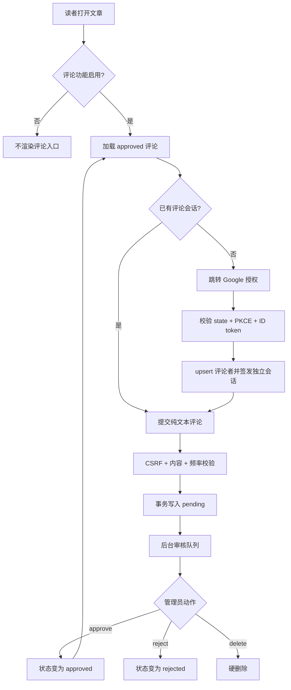

# Google 登录评论与审核设计

## 0. 术语约定

| 术语 | 定义 | 防冲突结论 |
|---|---|---|
| 管理员 | 现有 `users` 表中的后台账号，通过现有 `token` JWT Cookie 登录 | 不等于评论者；现有 `authenticateToken` 只保护后台 |
| 评论者 | 通过 Google 登录、可提交评论的公开站点用户 | 新增独立身份，不写入 `users` 表，不获得后台权限 |
| Google 身份 | Google 验证后的 `sub` 与展示名 | `sub` 是稳定身份键；不以 email 作为主键，不保存 Google token |
| 评论会话 | 评论者登录后得到的独立 `comment_session` HttpOnly Cookie，固定 7 天有效 | 不复用管理员 `token` Cookie、JWT secret 或 middleware |
| 审核状态 | `pending`、`approved`、`rejected` 三态 | 新评论只能从 `pending` 起步；公开页面只读取 `approved` |
| 公开评论 | 已批准并在文章详情页展示的单层纯文本反馈 | 不包含回复、编辑、点赞、通知或用户主页 |

## 1. 决策与约束

### 1.1 需求摘要

读者用 Google 账号确认身份后，可在文章下提交纯文本评论。新评论进入后台审核队列，管理员可以批准、拒绝或删除；只有批准评论向访客公开。成功标准是登录、提交、审核、公开展示形成可验证的完整闭环，同时任何评论者都不能获得管理员权限。

明确不做：匿名评论、即时公开、回复、编辑、通知、点赞、用户主页、Google token 长期保存、管理员认证重构、NestJS/Fastify 迁移、EJS 6 升级或 Node 24 基线重做。

### 1.2 复杂度档位

- 健壮性与安全性采用生产公开写接口档位：外部输入全校验，OAuth、CSRF、越权和滥用路径必须有明确错误语义。
- 安全性 = `hardened`，高于公开服务默认的 `validated`：Google 回调和公开写入面属于对抗性信任边界。
- 性能 = `reasonable`，低于公开服务默认的 `budgeted`：当前是 PM2 单实例个人博客，不设 QPS 预算，但禁止循环查库和无索引公开查询。
- 可观测性 = `logged`，低于公开服务默认的 `traced`：没有跨服务链路，记录登录失败类别、评论提交和审核动作即可，日志不得包含 token、secret 或评论全文。
- 结构 = `modules`、可测试性 = `tested`、可读性 = `team`；兼容性只支持仓库已经声明的 Node 24。

### 1.3 关键决策

#### 决策 A：Node 24 视为已完成基线，依赖只做必要增量

当前运行时是 Node 24.15.0，仓库已固定 `>=24 <25`，2026-07-16 的生产依赖审计为 0 漏洞。实现只新增官方 `google-auth-library`；不为“全面升级”强行引入 EJS 6，因为它不是 Node 24 兼容前提，且会把模板大版本迁移与评论功能耦合。

#### 决策 B：评论者与管理员采用独立身份域

新增评论者身份与会话，不扩展现有管理员 `users` 表，不复用管理员 Cookie。这样 Google 用户即使构造管理员字段，也无法穿过现有 `authenticateToken`；删除评论模块时也不会改变后台认证语义。

#### 决策 C：采用服务端 authorization-code flow，不保存 Google token

登录入口生成 `state` 与 PKCE verifier，回调同时校验 state、code verifier、ID token 签名与 audience；本地只保存 Google `sub` 和规范化展示名。授权请求只取 `openid profile`，使用 online access，不保存 access token、refresh token 或 email。

Cookie 契约固定如下：

- `comment_oauth`：用独立 root secret 派生的 OAuth 子密钥签名，载荷含随机 state、PKCE verifier、安全 return path、issuer/audience/token_use 和 10 分钟过期时间；属性为 `HttpOnly`、`SameSite=Lax`、生产 `Secure`、`Path=/auth/google/callback`。回调无论成功或失败都先清除；缺失、篡改、过期或 state 不匹配均返回 400 且不交换 code，清除后重放不能通过。
- `comment_session`：用 session 子密钥签名，载荷只含本地评论者 ID、随机 CSRF nonce、issuer/audience/token_use 和 7 天过期时间；属性为 `HttpOnly`、`SameSite=Lax`、生产 `Secure`、`Path=/`、Cookie `maxAge` 与 JWT TTL 一致。middleware 每次从数据库读取当前展示名，不把 profile 数据固化进 JWT。
- 文章页把已验证 session 中的 CSRF nonce作为隐藏表单字段投影到 HTML；评论提交与登出必须回传并常量时间比较。登出清除 Cookie 并返回 204；过期/无效会话视为未登录。主动撤销单个会话不在第一版，轮换 `COMMENT_SESSION_SECRET` 会使全部评论会话失效。

两类 token 不直接共用同一签名 key：从 `COMMENT_SESSION_SECRET` 用 HKDF-SHA256 和固定 context `comment-oauth` / `comment-session` 派生两个子密钥，只允许 `HS256`。OAuth context 固定 `iss=minimalist-blog-comments`、`aud=google-oauth-callback`、`token_use=oauth_context`；评论会话固定相同 issuer、`aud=comment-session`、`token_use=comment_session`，并要求字符串 `sub` 与 CSRF nonce。两个 verifier 必须同时校验算法、签名、issuer、audience、token_use、过期时间及各自必填 claim，任何跨类型 token 都按无效处理。

#### 决策 D：评论是持久化审核状态机

新评论原子写入 `pending`；管理员可将任意未删除评论切换为 `approved` 或 `rejected`，重复提交相同目标状态是幂等操作；删除是不可逆硬删除。拒绝保留内容与审核信息，便于管理员复核；文章删除时评论级联删除。

状态转换与审核元数据：

| 当前状态 | 目标状态 | 结果 |
|---|---|---|
| `pending` | `approved` / `rejected` | 允许；写入当前管理员与审核时间 |
| `approved` | `rejected` | 允许；立即从公开页隐藏并覆盖审核人/时间 |
| `rejected` | `approved` | 允许；立即公开并覆盖审核人/时间 |
| 任意状态 | 同一状态 | 幂等返回当前记录，不改变 `reviewed_by` / `reviewed_at` |
| `approved` / `rejected` | `pending` | 422；不允许撤回到未审核状态 |
| 已删除 | 任意状态 | 404 |

#### 决策 E：服务端渲染单层纯文本评论

文章详情页直接加载批准评论并用 EJS 转义输出，换行仅通过 CSS 保留。第一版不提供公开评论查询 API、Markdown/HTML 评论、客户端富文本或树状关系。

#### 决策 F：限流以已登录评论者为持久边界

评论创建在同一 SQLite 事务中检查该评论者最近窗口内的提交数量并插入，默认假设为 10 分钟最多 5 条。它不会存储原始 IP；Google 登录和先审后显仍不能替代服务端限流。

#### 决策 G：配置采用完整启用、完整关闭、部分配置失败

先对 `GOOGLE_CLIENT_ID`、`GOOGLE_CLIENT_SECRET`、`GOOGLE_REDIRECT_URI`、`COMMENT_SESSION_SECRET` 做 trim，空白值按缺失处理。全部缺失时评论入口不挂载、文章页不显示评论区，访问评论专用路由由现有末尾 404 处理；只配置一部分时启动失败。全部存在时还必须满足：redirect URI 是无 credentials、query、fragment 的绝对 URL，pathname 必须精确为 `/auth/google/callback`；生产环境只允许 HTTPS，本地开发仅允许 `http://localhost` / `http://127.0.0.1`；session secret 的 UTF-8 长度至少 32 字节。无效时启动失败并只点明 key 与原因，不输出值。

### 1.4 基线风险

- 当前工作区没有 `node_modules`：`node --check` 已通过，但 `npm test` 因 `ejs`、`better-sqlite3` 等模块未安装而失败；这不是现有测试断言失败。implementation 第一个预检必须先执行 `npm ci`，再重跑完整测试。
- `npm audit --omit=dev` 基于 lockfile 已通过且漏洞数为 0；新增 Google 官方库后必须重跑。
- Google OAuth 的真实浏览器闭环依赖 owner 在 Google Cloud 创建 Web OAuth client，并登记与部署域名完全匹配的 redirect URI；没有真实凭证时只能完成 fake adapter 集成测试，不能宣称生产登录验收通过。

### 1.5 Top 3 风险与缓解

1. **身份边界混淆导致评论者获得后台权限**：独立表、独立 Cookie 名、独立 secret/audience、独立 middleware；验收必须证明评论会话访问 `/admin` 和管理 API 均失败。
2. **OAuth 回调被伪造或被开放重定向滥用**：短时 state + PKCE、固定 redirect URI、只允许站内 `/article/{slug}` return path，回调失败不创建身份或会话。
3. **审核状态或 SQL 条件错误导致待审/拒绝内容公开**：公开查询硬编码 `status = 'approved'`，状态机与文章渲染使用同一 store interface，集成测试覆盖 pending/rejected 永不出现在 HTML。

### 1.6 非显然依赖与关键假设

- 外部依赖：Google Cloud OAuth client、HTTPS 生产域名和四个配置项；阻塞真实 OAuth 验收与部署，不阻塞 fake adapter 下的实现测试。
- 假设：站点继续是单 PM2 实例、评论量较低；第一版公开列表不分页，按创建时间升序显示全部批准评论。
- 假设：评论正文去除首尾空白后按 Unicode code point 计数为 1–1000；展示名去除控制字符和首尾空白后，用 `Array.from(name).slice(0, 80).join('')` 按 code point 截断，结果为空时显示“读者”。
- 假设：批准评论会公开显示规范化 Google 展示名；登录/提交区必须在授权前明确告知这一点。第一版不采集、不保存、不展示 Google 头像或 email。
- 假设：评论只引用 `comment_users` 当前展示名，不保存姓名快照；评论者以后再次登录并更新 Google 名称时，历史评论署名随之更新。这让隐私名称修正可向历史内容生效。
- 假设：默认限流为每个评论者 10 分钟 5 条；阈值由配置常量集中管理，不暴露给客户端决定。
- 假设：评论会话固定 7 天且没有单会话即时撤销；用户可登出，管理员可通过轮换独立 secret 撤销全部会话。
- 假设：管理员硬删除会移除该条评论对当前限流窗口的贡献；只有管理员能删除，这是主动解除审核队列压力时可接受的语义。
- 假设：现有 Express/CommonJS 架构是本 feature 的兼容边界。仓库级 NestJS/Fastify 迁移属于另一个 epic，不在评论功能中暗做。

### 1.7 清洁度规则

不得提交 token、OAuth secret、真实 Google 账号数据、评论全文日志、临时调试输出、TODO/FIXME、注释掉代码或无用 import。测试凭证必须是显式 fake 值；生产 secret 只通过环境变量提供。

## 2. 名词与编排

### 2.1 名词层

#### 现状

- `server/scripts/init-db.js` 创建 `articles` 与管理员 `users` 表；`server/db.js` 打开 SQLite 并启用外键。
- `server/middleware/auth.js` 解析名为 `token` 的管理员 JWT，并把载荷写入 `req.user`。
- `server/index.js` 的 `/article/:slug` 只加载文章并渲染 `views/article.ejs`；当前没有评论者、评论、审核状态或 Google 身份概念。
- `server/routes/admin.js` 处理文章上传/删除，不适合作为评论审核的新职责容器。

#### 变化

新增以下持久名词：

| 名词 | 核心字段与约束 |
|---|---|
| `CommentUser` | `id`、唯一 `google_sub`、公开 `display_name`、`created_at`、`updated_at`、`last_login_at`；不采集头像，不保存 email 或 Google token |
| `Comment` | `id`、`article_id`、`comment_user_id`、`content`、`status`、`created_at`、`reviewed_at`、`reviewed_by`；正文 1–1000 字符 |
| `CommentStatus` | `pending \| approved \| rejected`；数据库 CHECK 约束与服务端校验保持一致 |
| `CommentSession` | JWT `sub` 为本地评论者 ID，固定 algorithm/issuer/audience/token_use，包含 CSRF nonce但不含展示名；middleware 每次查 `comment_users`；与管理员 JWT 完全隔离 |
| `GoogleIdentity` | 验证后的 `{ subject, displayName }`；只由 Google identity adapter 产出 |

数据库约束与索引：

- `comments.article_id → articles.id ON DELETE CASCADE`。
- `comments.comment_user_id → comment_users.id ON DELETE RESTRICT`。
- `comments.reviewed_by → users.id ON DELETE SET NULL`。
- 公开读取索引 `(article_id, status, created_at)`；限流索引 `(comment_user_id, created_at)`；审核队列索引 `(status, created_at)`。

接口示例：

```text
POST /api/articles/42/comments
Cookie: comment_session=<valid>
Body: { "content": "谢谢分享", "csrfToken": "<session nonce>" }
→ 201 { "comment": { "id": 7, "status": "pending", "createdAt": "..." },
        "message": "评论已提交，等待审核" }

主要错误：
→ 401 未登录；403 CSRF 校验失败；404 文章不存在；
→ 422 内容为空/过长；429 超过提交频率。评论功能关闭时路由不挂载，由站点返回普通 404。
// 来源：新增评论公开路由；现状挂载模式参考 server/routes/articles.js
```

```text
PATCH /api/admin/comments/7
Cookie: token=<admin JWT>
Body: { "status": "approved" }
→ 200 { "comment": { "id": 7, "status": "approved", "reviewedAt": "..." } }

DELETE /api/admin/comments/7
→ 204

主要错误：
→ 401/403 管理员认证失败；404 评论不存在；422 非法状态。
// 来源：新增评论审核路由；管理员认证来源 server/middleware/auth.js authenticateToken
```

```text
GET /auth/google?returnTo=/article/node-24
→ 302 Google authorization URL（openid profile + state + PKCE）

GET /auth/google/callback?code=...&state=...
→ 验证 Google identity，upsert CommentUser，设置 comment_session，
  302 回安全的站内文章路径。
// 来源：Google 官方 google-auth-library authorization-code / verifyIdToken 契约
```

##### Interface 设计检查

- Module：`createCommentsModule({ db, config, identityClient, clock })`（新增），统一拥有评论 schema、状态机、查询与路由编排；返回启用状态、评论者 session middleware、auth/public/admin routers 与文章评论 view-model 查询。
- Interface：caller 只知道“验证后的 Google identity”“评论会话”“创建/审核/公开查询评论”；非法状态、找不到实体和限流分别有稳定错误语义。
- Seam：Google identity client 是 true external seam；production 入口把官方 adapter 注入 module factory。HTTP 测试用临时 SQLite、fake clock 和 fake identity client 创建同一 module，再挂载它返回的同一组 middleware/routers 到最小 Express harness；不增加生产可达的 test mode，也不要求重构整个 `server/index.js` 为 app factory。
- Depth / locality：OAuth token 交换、ID token 验证与 claim 规范化藏在 adapter；SQL、状态过滤与事务藏在 comment store。删除这两个 module 会让安全与持久化知识重新散回多个路由，因此不是 pass-through。
- Dependency strategy：Google = `true external`；SQLite = `local-substitutable`（测试使用临时数据库并穿过同一 store interface）；JWT/校验 = `in-process`。
- Adapter：Google 有 production adapter 与 test fake；SQLite 不再额外包“repository adapter”，直接让 store 成为本地替换 seam，避免单实现假抽象。
- Test surface：OAuth 成功/失败通过 identity interface；pending 不公开、状态切换、级联删除和限流通过 store + HTTP 路由观察。

Google identity interface 固定为两个操作：

```text
identityClient.createAuthorizationUrl({ state, codeChallenge })
→ absolute Google URL

identityClient.exchangeCode({ code, codeVerifier })
→ Promise<{ subject: string, displayName: string | null }>
```

module 自己拥有 state、PKCE、return path、Cookie 和 session；adapter 内部完成 `getToken`、检查 `id_token`、`verifyIdToken` 与 audience，不把 raw token 返回给 caller。稳定错误分类与 HTTP 映射唯一固定：`provider_denied`（用户取消）→ 400；`invalid_callback`（缺 code、参数异常或 invalid_grant）→ 400；`exchange_failed`（网络、超时或 Google 5xx）→ 502；`identity_invalid`（缺 id_token、验签/audience/claim 失败）→ 400。日志只记录分类和 request correlation，不记录 code/token/subject。

### 2.2 编排层



#### 现状

`server/index.js` 是线性启动与分支路由入口：解析 Cookie、挂载 API、直接定义公开/后台页面路由，再启动监听。管理员 JWT 是唯一会话；文章详情只查询文章。SQLite 写入由同步 wrapper 或模块 store 完成，analytics 已采用“启动初始化 schema + 独立 store”的本地模式。

#### 变化

1. 启动时解析评论配置：trim 后全缺失则禁用；全存在且 URI/secret 有效时以 production identity client 创建 comments module 并初始化 schema/routers；空白、部分、非法 URI 或弱 secret 则拒绝启动。测试通过相同 module factory 注入 fake，而不是修改全局 require。
2. Google 登录支线只负责身份建立：短时 OAuth 上下文 Cookie 保存 state/PKCE/安全 return path；成功后清理上下文并签发评论会话，失败不写用户或会话。
3. 文章详情在评论启用时通过 comment store 一次性读取批准评论，并根据独立评论会话渲染登录按钮或提交表单。
4. 提交评论在一个同步 SQLite 事务中完成文章存在性、窗口计数与 pending 插入；返回待审核回执，不把新内容拼回公开 HTML。
5. 管理员审核页面默认展示 pending，并可按状态查看；批准/拒绝更新状态与审核人/时间，删除硬删除；公开查询始终只取 approved。

#### 流程级约束

- **错误语义**：`provider_denied`、`invalid_callback`、`identity_invalid` 唯一映射为 400 登录失败页；`exchange_failed` 唯一映射为 502 可重试失败页。全部路径先清 OAuth Cookie，不 upsert、不发 session，并记脱敏错误分类。业务校验用 401/403/404/422/429，未知错误统一 500，不回显内部异常或 token。
- **幂等性**：评论提交是非幂等写入，前端提交期间禁用按钮；审核相同目标状态幂等，重复批准不会改创建时间；删除后重复删除返回 404。
- **并发与顺序**：Google `sub` 唯一约束处理并发首次登录；限流检查与评论插入同一 SQLite transaction；公开评论按 `created_at ASC, id ASC` 稳定排序。
- **CSRF**：OAuth 使用 state + PKCE；评论创建/登出校验评论会话中的 nonce；新增管理员审核写接口除管理员 Cookie 外还校验同源请求。
- **Cookie 生命周期**：OAuth 上下文只活 10 分钟并在 callback 首次消费时清除；评论会话固定 7 天，过期视为未登录。所有失败路径不得把 Cookie/token 值写入日志或响应。
- **展示名隐私**：只有评论批准后，规范化展示名才与正文一起公开；登录/提交前告知。头像、email、Google subject 与 token 永不进入公开 view-model。
- **返回路径**：只接受 `/article/{safe-slug}` 形态的站内路径，其他值回退首页，禁止开放重定向。
- **可观测性**：记录 OAuth 失败类别、评论 ID/状态变化/管理员 ID、限流触发；不记录 secret、token、Google subject、评论正文或完整请求体。
- **配置关闭**：禁用时不建评论路由、不显示 UI、不查询评论表；既有博客功能保持原状。

### 2.3 挂载点清单

1. 运行时依赖与配置：`package.json` / lockfile + `GOOGLE_CLIENT_ID`、`GOOGLE_CLIENT_SECRET`、`GOOGLE_REDIRECT_URI`、`COMMENT_SESSION_SECRET` — 新增。
2. SQLite schema：评论者表、评论表及三个索引 — 新增，启动时幂等初始化。
3. 公开身份与评论入口：Google 登录/回调/登出及文章评论提交路由 — 新增。
4. 文章详情页：`/article/:slug` 与 `views/article.ejs` 的批准评论列表、登录/提交/空态/错误态 — 修改。
5. 后台审核入口：评论审核页面、管理 API 与后台导航链接 — 新增/修改。

### 2.4 推进策略

1. **编排骨架**：建立评论模块入口、配置三态和路由/store interface，先用空结果跑通启用/禁用挂载。退出信号：全缺配置时现有博客行为不变，部分配置时启动明确失败，完整 fake 配置时路由存在。
2. **身份节点**：接通固定两方法 Google identity adapter、state/PKCE、派生子密钥 token、评论会话与安全 return path。退出信号：fake adapter 下成功登录、provider 失败、跨 token、篡改/过期/重放和登出路径均符合 Cookie/错误契约。
3. **持久化节点**：实现评论者 upsert、评论 schema、pending 创建、批准查询、状态切换与级联删除。退出信号：临时 SQLite 集成测试覆盖唯一身份、三态与索引驱动查询。
4. **公开评论闭环**：文章页接入批准评论、登录状态、纯文本提交与等待审核反馈。退出信号：登录用户提交后得到 pending 回执，未审核内容不出现在文章 HTML。
5. **后台审核闭环**：新增审核列表和批准/拒绝/删除动作。退出信号：管理员动作改变公开可见性，评论会话不能调用管理入口。
6. **横切安全回归**：不重复实现各节点逻辑，只从完整 HTTP 流程验证跨边界攻击、两类 token/会话隔离、provider 失败、同源策略、日志脱敏和清洁度。退出信号：伪造/重放/跨类型 OAuth、CSRF、权限混淆和敏感信息泄漏回归全部通过。
7. **UI polish**：覆盖未登录/已登录/空态/提交中/待审成功/错误/禁用、小屏、长正文/展示名、键盘 focus 与隐私告知。退出信号：评论区和审核页的全部可见状态有浏览器证据且交互可恢复。
8. **发布验证**：更新环境变量、Google redirect URI 与回滚说明，执行干净安装、测试、审计和真实 Google 登录 smoke。退出信号：全部命令与真实 OAuth 闭环通过，生产凭证未进入仓库。

### 2.5 结构健康度与微重构

##### 评估

- Compound：当前只有 `.gitkeep`，没有目录归属或命名 convention 可复用。
- 文件级 — `server/index.js`：270 行，混合启动、公开页面和后台页面三类职责；本 feature 只允许新增模块挂载和文章详情数据注入，不把 OAuth、SQL 或审核计算写入该文件。
- 文件级 — `server/routes/admin.js`：305 行，已集中上传解析、图片和文章删除；评论审核与这些职责无关，本 feature 不修改该文件，使用独立管理路由。
- 文件级 — `views/article.ejs`：37 行，单一文章展示职责；加入文章所属评论区仍是自然职责延伸。
- 目录级 — `server/` 已有 `analytics/` 独立业务目录，本次新增 `comments/` 延续同一归属模式，不继续摊平 `server/routes/`。
- 目录级 — `views/admin/` 当前 4 个同层文件，本次新增 1 个审核页，不触发目录摊平阈值。
- 目录级 — `test/` 当前 6 个顶层测试文件，本次预计新增 2 个，现状未达到“已有 ≥8 且再加 ≥2”的重组触发条件。

##### 结论：不做前置微重构

通过新 comments 模块和独立管理路由限制改动密度即可；为了评论功能先搬动既有页面路由会扩大回归面，且不能提高本 feature 的用户价值或安全正确性。

##### 超出范围的观察

- `server/index.js` 长期混合公开页面、后台页面和启动职责；如果后续再新增第二个页面型子系统，建议单独走 `cs-refactor` 拆出 page routers，本 feature 不改调用语义。

## 3. 验收契约

### 3.1 关键场景清单

| ID | 场景 | 输入 / 触发 | 期望可观察结果 | 证据类型 |
|---|---|---|---|---|
| SC-01 | 配置关闭 | 四个评论配置全部缺失并启动，再访问评论专用路径 | 博客正常启动、文章页无评论 UI，评论路径返回现有普通 404 | 集成测试 + HTTP |
| SC-02 | 配置不完整/无效 | 提供空白值、部分配置、相对 URI、错误 callback path、credentials/query/fragment、生产 HTTP URI 或少于 32 字节的 secret | 启动非零退出并只列出缺失/无效 key 与原因，不输出配置值 | 子进程测试 |
| SC-03 | Google 登录成功 | 正确 state/PKCE、fake identity 与安全 return path | upsert 评论者，设置 7 天独立 Cookie，清除 OAuth Cookie并回文章 | 集成测试 + Cookie 断言 |
| SC-04 | OAuth context 篡改/过期/重放 | state、PKCE、签名、issuer/audience/token_use、TTL 或 return path 非法；消费后重放 callback | 不交换或不接受身份，不创建 session，不外跳；OAuth Cookie 已清除 | 集成测试 |
| SC-05 | 会话混淆、过期与登出 | session 签名/issuer/audience/token_use 非法、用 OAuth token 冒充 session、过期 session、合法/伪造登出 | 非法/过期/跨类型 token 视为未登录；合法登出 204 并清 Cookie；伪造登出 403 | 集成测试 + Cookie 断言 |
| SC-06 | 未登录提交 | 无评论会话 POST 评论 | 401，数据库无新增评论 | API 响应 + DB |
| SC-07 | 合法提交 | 登录用户提交 1–1000 code points 纯文本及正确 CSRF | 201 + pending 回执；文章 HTML 不包含该内容 | API 响应 + DB + HTML |
| SC-08 | 展示名隐私与边界 | 正常/含特殊字符/80/81+ code points/缺失的 Google 展示名，以及再次登录后改名 | UI 预先告知会公开名称；按规则截断或 fallback，批准后转义显示；无头像/email；历史评论使用更新后的当前名称 | 集成测试 + HTML |
| SC-09 | 内容边界 | 空白、1001 code points、HTML/script 字符串、emoji 边界 | 空白/过长返回 422；合法特殊字符和 emoji 按 code point 计数并转义显示 | 测试 + 渲染 HTML |
| SC-10 | 提交限流 | 同一评论者 10 分钟内第 6 次提交 | 429，第 6 条不写库 | 集成测试 + DB |
| SC-11 | 管理员批准/重新批准 | `pending→approved`、`rejected→approved` 或重复 approved | 不同状态转换覆盖审核人/时间并公开；同状态重放不改审核元数据 | API + DB + 浏览器 |
| SC-12 | 管理员拒绝/重新拒绝 | `pending→rejected`、`approved→rejected`、重复 rejected 或尝试回 pending | 不同状态转换覆盖审核元数据并隐藏；同状态重放不改元数据；回 pending 返回 422 | API + DB + HTML |
| SC-13 | 管理员删除 | 管理员删除任意状态评论并再次删除 | 首次 204，之后 404；审核页和公开页均不存在 | API + DB |
| SC-14 | 权限隔离与 CSRF | 评论会话访问审核 API、管理员 Cookie 提交评论、伪造评论/审核 CSRF | 越权为 401/403，伪造请求不改变数据库 | 集成测试 |
| SC-15 | 文章删除 | 删除包含评论的文章 | 关联评论级联删除，不留孤儿记录 | DB 集成测试 |
| SC-16 | UI 状态 | 未登录、已登录、提交中、待审成功、错误、禁用、空列表、长文本/名称、小屏、键盘操作 | 每个状态可见，隐私告知清楚，按钮/焦点/文本不溢出，错误可恢复 | 浏览器截图 + 手工 |
| SC-17 | 回归与发布 | 干净安装、完整测试/审计、HTTP smoke、真实测试 Google client 登录 | 既有功能正常，high/critical 为 0，真实 OAuth 闭环可用且仓库无凭证 | 命令输出 + HTTP + 浏览器 |
| SC-18 | OAuth provider 错误 | Google 返回 `access_denied`、缺 code、invalid_grant、网络/5xx、缺 id_token 或身份验证失败 | 不 upsert、不发 session、清 OAuth Cookie；前三类/身份无效固定 400，网络/5xx 固定 502，日志只有脱敏分类 | fake adapter HTTP 集成测试 |

### 3.2 明确不做的反向核对

- 数据库不存在 `parent_comment_id`、点赞、通知、评论编辑或用户主页相关表/字段/路由。
- 评论提交 API 不接受匿名请求，不返回 `approved` 初始状态。
- 代码、日志和数据库不保存 Google access token、refresh token、email 或头像 URL。
- 评论内容不经过 Markdown/HTML 渲染器，EJS 输出位置不得使用未转义插值。
- `package.json` 不升级 EJS major，不改变 Node `>=24 <25` 契约，不引入 NestJS/Fastify 或 Passport。
- 现有管理员 `users` 表、`token` Cookie 与 `authenticateToken` 的公开语义不被评论者身份扩展。

### 3.3 Acceptance Coverage Matrix

| Scenario | Covered By Step | Evidence Type | Command / Action | Core? |
|---|---|---|---|---|
| SC-01 配置关闭 | S1 | 子进程测试 + HTTP | `npm test` | yes |
| SC-02 配置不完整/弱 secret | S1 | 子进程测试 | `npm test` | yes |
| SC-03 Google 登录成功 | S2 | fake adapter HTTP 集成测试 | `npm test` | yes |
| SC-04 OAuth 篡改/过期/重放 | S2 + S6 | fake adapter 攻击测试 | `npm test` | yes |
| SC-05 会话过期与登出 | S2 | Cookie/HTTP 集成测试 | `npm test` | yes |
| SC-06 未登录提交 | S4 | API + DB | `npm test` | yes |
| SC-07 合法 pending 提交 | S3 + S4 | API + DB + HTML | `npm test` | yes |
| SC-08 展示名隐私与边界 | S2 + S4 + S7 | DB + HTML + 浏览器 | `npm test` + 浏览器 smoke | yes |
| SC-09 内容边界 | S4 | API + HTML | `npm test` | yes |
| SC-10 提交限流 | S3 | 事务集成测试 | `npm test` | yes |
| SC-11 管理员批准 | S3 + S5 | API + DB + 浏览器 | `npm test` + 浏览器 smoke | yes |
| SC-12 管理员拒绝 | S3 + S5 | API + HTML | `npm test` | yes |
| SC-13 管理员删除 | S3 + S5 | API + DB | `npm test` | yes |
| SC-14 权限隔离与 CSRF | S5 + S6 | 攻击集成测试 | `npm test` | yes |
| SC-15 文章删除级联 | S3 | DB 集成测试 | `npm test` | yes |
| SC-16 UI 全状态 | S7 | 浏览器截图 | 本地浏览器 smoke | yes |
| SC-17 回归与发布 | S8 | 命令 + HTTP + 真实浏览器 | CMD-001–004 + Google smoke | yes |
| SC-18 OAuth provider 错误 | S2 + S6 | fake adapter HTTP 集成测试 | `npm test` | yes |
| §3.2 明确不做反向核对 | S6 + S8 | diff review + grep | review checklist | no |

### 3.4 DoD Contract

| ID | 要求 | 证据 | 阻塞级别 |
|---|---|---|---|
| DOD-DESIGN-001 | design、checklist、身份边界与验收矩阵通过独立 design review | design-review report | blocking |
| DOD-IMPL-001 | checklist steps 全部完成，配置/schema/routes/views/docs 交付物真实落盘 | checklist + diff + step evidence | blocking |
| DOD-REVIEW-001 | 独立 code review passed 且无 unresolved blocking finding | review report | blocking |
| DOD-QA-001 | Standard lane 的 accept-inline matrix 覆盖全部 core 场景；若启用独立 QA 则报告必须 passed | acceptance inline evidence / QA report | blocking |
| DOD-ACCEPT-001 | requirement 状态、架构提炼、验证命令与最终清洁度完成审计 | acceptance report | blocking |

Validation Commands：

| ID | 命令 | 目的 | 核心性 | 失败处理 |
|---|---|---|---|---|
| CMD-001 | `npm ci` | 在 Node 24 从 lockfile 干净安装，包括原生依赖 | core | fix-or-block |
| CMD-002 | `npm test` | 覆盖现有回归与评论身份/存储/路由/视图场景 | core | fix-or-block |
| CMD-003 | `npm audit --omit=dev --audit-level=high` | 验证新增依赖后的生产 high/critical 为 0；更低级别若存在必须记录来源与处置 | core | fix-or-block |
| CMD-004 | `npm ls --depth=0` | 验证直接依赖全部安装且无 unmet/invalid | supporting | fix-or-block |

Required Artifacts：draft/approved design、checklist、passed design-review、passed code review、acceptance inline evidence、关键 UI 截图、配置/部署文档、真实 Google 登录手工证据。

### 3.5 交付物清单

- 评论能力依赖与四个环境配置契约；Google Cloud redirect URI 配置说明。
- 评论者/评论 schema、索引与启动初始化。
- Google identity production adapter + test fake、独立评论会话与安全 middleware。
- 公开评论提交路由、后台审核路由、文章评论区与审核页面。
- OAuth、权限隔离、状态机、限流、XSS/CSRF、级联删除与现有功能回归测试。
- README/DEPLOY 更新；feature design-review、review、acceptance 证据；验收后 `reader-comments` requirement 从 draft 更新为 current。

### 3.6 自我批判结论

- 场景均可由 HTTP、DB、HTML、命令或浏览器证据证伪，已删除“体验良好”等弱标准。
- 最弱依赖是 Google OAuth 真实凭证；已拆成 fake adapter 自动测试与真实浏览器最终验收两层，不用 fake 冒充生产完成。
- 身份、持久化、公开 UI、审核 UI 与 hardening 分步可独立验证，没有把两套会话混进同一步。
- 明确记录本地缺 `node_modules` 的红灯归因，implementation 不会把当前缺依赖误判为 feature 回归。
- Interface 保留真正需要替换的 Google external seam；没有为 SQLite 再套单实现 pass-through repository。

## 4. 与项目级架构文档的关系

验收通过后应把“管理员身份域”和“评论者身份域”两个名词、评论审核状态机及 Google external adapter 边界提炼到项目架构文档。身份域隔离属于跨 feature 稳定安全约束，但当前 architecture 仍是空骨架；是否进一步写 ADR 在整体 design review 时由 owner 决定，不在本 design 自动创建。
