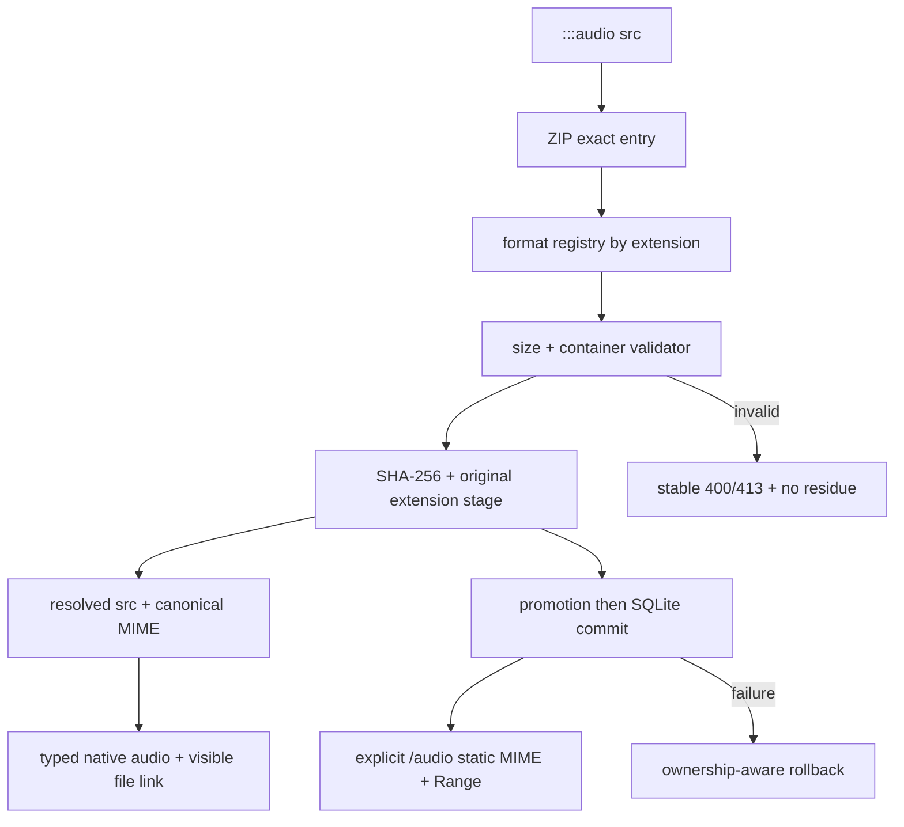

# 文章音频多格式支持 Design

## 0. 术语约定

| 术语 | 定义 | 防冲突结论 |
|---|---|---|
| 音频格式描述（Audio Format Descriptor） | 扩展名、标准 MIME、单文件上限和内容校验规则组成的受控记录 | 是现有 Article Audio Asset 的内部格式元数据，不新增歌曲/媒体领域实体 |
| ADTS AAC | 扩展名 `.aac` 的原始 AAC 传输流，本轮按连续完整 ADTS frame 校验 | 与 `.m4a` 容器明确区分，不能只看 AAC 编码名称混用 |
| AAC/M4A | 扩展名 `.m4a`、MIME `audio/mp4`，容器必须为结构闭合的 ISO BMFF，且 `soun` track 的 sample description 必须是携带受支持 AAC Audio Object Type 的 `mp4a` | 不把任意 MP4/ALAC 当作 AAC/M4A |
| FLAC | 扩展名 `.flac`、MIME `audio/flac`，含 `fLaC` marker、首个 STREAMINFO 和 CRC-8 合法的音频 frame header | 使用 IANA 标准 MIME，不沿用依赖默认的 `audio/x-flac` |

## 1. 决策与约束

### 1.1 需求摘要

博主可以在既有文章 ZIP 中引用 `.mp3`、`.aac`、`.m4a` 或 `.flac`；四种格式继续通过同一个 `:::audio` 块、同一个上传入口和同一个原生播放器展示。系统不转码、不探测歌曲元数据、不新增上传页面或数据库实体。

成功标准：四种扩展名都经过与其容器对应的内容校验，以 `{sha256}.{extension}` 发布；HTTP 返回标准 MIME；Chromium 对四种格式完成真实播放，当前 WebKit 对 MP3/AAC/M4A 完成真实播放，FLAC 在未提供解码器时仍显示可访问的“打开音频文件”入口且不破坏文章。

明确不做：

- 不支持 `.wav`、`.ogg`、`.opus`、`.alac`、`.mp4` 或其他未列扩展名。
- 不做 ffmpeg 服务端转码、自动生成兼容副本、码率/声道/采样率规范化。
- 不把 `.m4a` 等同任意 MP4；没有 `mp4a` sample entry 的容器拒绝。
- 不承诺所有浏览器/操作系统都内置 FLAC 解码器；页面只提供原生播放和无脚本文件入口。
- 不改变文章音频块字段，不新增 format/type 字段；格式由受控 `src` 扩展名和内容共同确定。
- 不新增表、迁移、播放统计、全站播放器或自定义 JavaScript 播放内核。

### 1.2 Compatibility / Security / Performance / Operations

**Compatibility**

- 现有 `.mp3` 作者语法、已保存 HTML、URL、删除、Range 和 `audioPublished` 语义保持兼容。
- 新发布 URL 从固定 `.mp3` 扩展为 `.mp3|.aac|.m4a|.flac`；同内容同扩展去重，不跨扩展合并。
- 原生 `<audio>` 改为带标准 `type` 的 `<source>`，并在播放器外保留始终可见的“无法播放时打开音频文件”链接；旧文章 HTML 不重写。

**Security**

- 扩展名与内容必须同时匹配；伪装、截断或不完整容器返回既有稳定 code `audio_content_invalid`。
- 未支持扩展名返回 `audio_format_unsupported`；路径、ZIP 歧义、XSS、slug、rollback 和日志脱敏规则不变。
- 格式校验全部在受限字节范围和声明长度内完成，不调用 shell/ffmpeg，不信任浏览器 MIME sniffing；这是容器结构筛查，不宣称完成整段媒体解码。

**Performance**

- MP3/AAC/M4A 单文件上限仍为 20 MiB；FLAC 上限提高到 50 MiB。
- ZIP 上传压缩包上限从 50 MiB 提高到 100 MiB；声明展开总量仍为 100 MiB，避免把单进程内存边界一起翻倍。
- 资产按 `(sha256, extension)` 去重；每个唯一 ZIP entry 校验、hash、写 stage 后立即释放 Buffer，不把多份 20/50 MiB 音频同时留在资产 map。
- 声明 entry size 在 `getData()` 前检查，实际 Buffer size 在校验前再检查；promotion 冲突通过流式 hash 验证，不把已发布 FLAC 整体读回内存。feature 自身额外同时持有的音频 Buffer 上限为 50 MiB；加上最多 100 MiB 的压缩 ZIP 及库开销，峰值不是“100 MiB”承诺。

**Operations**

- `/audio` 改为显式静态挂载并按扩展名固定 `audio/mpeg`、`audio/aac`、`audio/mp4`、`audio/flac`；GET/HEAD/Range 和 analytics 排除继续有效。
- 无新环境变量、外部服务或运行依赖；本机 ffmpeg 只用于生成确定性合成测试素材，不进入 package/runtime。

### 1.3 关键决策

1. **集中格式注册表**：扩展名、MIME、上限和 validator 必须来自唯一只读 registry；资产、renderer、静态响应和测试不各自维护一份漂移映射。
2. **容器级有界结构校验**：MP3 保持原连续 frame 契约；AAC 从 ID3 后首字节开始连续消费到 EOF；M4A 按明确的 box/descriptor/AAC profile 契约解析；FLAC 从 metadata 结束后的首字节解析一个 CRC-8 合法 frame header。它们拒绝伪 magic/越界结构，但不解码全媒体 payload。
3. **保留真实扩展名**：最终 URL 为 `/audio/{slug}/{64hex}.{extension}`，Content-Type 由 registry 决定，不把所有内容伪装为 `.mp3`。
4. **浏览器能力诚实降级**：WHATWG 允许 `canPlayType()` 返回空/`maybe`/`probably`，但实际解码仍受浏览器构建影响；不以 sniff 结果替代真实播放证据，FLAC 无解码器时依赖显式文件链接。
5. **不引入媒体解析库**：当前只需要四种受控容器的有限结构验证；新依赖会扩大攻击面和升级责任。若未来新增更多 MP4 codec/通用 metadata，才重新评估成熟 parser。

### 1.4 风险、假设与证据计划

**Top 3 风险**

1. M4A/FLAC 校验只认 magic 导致伪造文件通过。缓解：先抽 registry/validator seam，再用截断/超深 box、伪 `mp4a` 字节、非 `soun` track、错误 STREAMINFO、坏 frame header CRC 反例驱动实现。
2. 扩展名、URL、DOM `type` 与 HTTP Content-Type 漂移。缓解：唯一 registry + 四格式 HTTP 表驱动测试 + IANA 标准 MIME 断言。
3. “服务器接受”被误报为“所有浏览器可播放”。缓解：Chromium/WebKit 真实合成媒体矩阵；已知 WebKit FLAC 缺解码时验证显式链接而非伪报播放成功。

**关键假设**

- owner 接受无转码，因此浏览器不支持某 codec 时不会由服务器生成 MP3 fallback。
- `.m4a` 本轮只接受 AAC-LC（Audio Object Type 2）；HE-AAC、HE-AACv2、ALAC、MP3-in-MP4 或其他 profile 后续必须先补浏览器实播矩阵再扩展。
- FLAC 50 MiB、压缩 ZIP 100 MiB 能覆盖当前博客歌曲发布；实现必须把 feature 自身的同时存活音频 Buffer 限制为一个最大资产，不能把 100 MiB 展开总量误当成实际进程峰值。

**事实依据**

- IANA 当前登记 `audio/mpeg`、`audio/aac`、`audio/mp4`、`audio/flac`：`https://www.iana.org/assignments/media-types/media-types.xhtml`。
- WHATWG `HTMLMediaElement.canPlayType()` 只给能力置信度，不能代替实际解码：`https://html.spec.whatwg.org/multipage/media.html`。
- W3C FLAC codec registration 明确以 `fLaC` 和 STREAMINFO 作为初始化描述：`https://www.w3.org/TR/webcodecs-flac-codec-registration/`。
- RFC 9639 规定首 metadata 必须是 STREAMINFO、metadata last-block 规则和 frame header CRC-8：`https://www.rfc-editor.org/rfc/rfc9639.html`。
- 2026-07-17 本地 HTTP spike：Chromium 实际播放四种 1 秒合成音频；WebKit 播放 MP3/AAC/M4A，FLAC 未进入 metadata-ready，页面级降级因此是验收契约而非遗留。

**基线与必跑命令**

- 已验收基线：`npm test` 为 105 tests / 104 passed / 1 Linux-only skipped；音频 Playwright 2/2；完整 EJS gate 的 17 HTML + 102 visual 通过。
- 必跑：目标 formats/assets/upload 测试、`npm test`、`npm run test:article-audio-browser`、`npm run test:ejs-upgrade-gate`、`npm ls --depth=0`。
- 测试素材必须为确定性合成音频，不提交真实歌曲；不得要求 CI/生产安装 ffmpeg。

**交付物与清洁度**

- 交付：格式 registry/validator seam、通用资产命名、显式 `/audio` MIME 静态入口、typed `<source>` 与文件链接、README 格式/限制表、四格式自动化和浏览器证据、acceptance 架构同步。
- 禁止：debug 输出、临时 TODO/FIXME、真实歌曲、运行时 ffmpeg、无用依赖、绝对本地路径、旧 EJS/custom.css/snapshot 更新。

## 2. 名词层与编排层

### 2.1 名词层：现状 → 变化

**现状**

- Article Audio Asset 在资产模块里隐含为 MP3：扩展名、校验、stage 文件名和发布 URL 都硬编码 `.mp3`。
- renderer 只接受 64-hex `.mp3` URL，`<audio>` 直接携带 `src`，HTTP MIME 依赖通用静态服务。

**变化**

```text
AudioFormatDescriptor = {
  extension: '.mp3' | '.aac' | '.m4a' | '.flac',
  mimeType: 'audio/mpeg' | 'audio/aac' | 'audio/mp4' | 'audio/flac',
  maxBytes: 20 MiB | 50 MiB,
  validate(buffer): void // 只能成功返回或抛安全 ArticleAudioInputError
}

ResolvedArticleAudioBlock = ArticleAudioBlock + {
  src: '/audio/{slug}/{sha256}.{extension}',
  mimeType: canonical MIME
}
```

示例：

```markdown
:::audio
title: Final Lossless Mix
src: ./audio/final.flac
:::
```

解析结果：合法 FLAC → `src=/audio/ai-song/{hash}.flac`、`mimeType=audio/flac`；ZIP 中同路径若实际为 MP3 bytes → 400 `audio_content_invalid`。

扩展名严格区分大小写，只接受四个小写值；资产 identity 始终写作 `(sha256, extension)`，不是无分隔符字符串拼接。`assets.js` 在 S1 后继续 re-export 既有 `MAX_AUDIO_BYTES`（20 MiB）与 `validateMp3Buffer`，避免“移动实现 + 同时改测试 import”掩盖 MP3 回归。

**格式 invariant**

| 扩展名 | MIME | 最大值 | 必须满足 |
|---|---|---:|---|
| `.mp3` | `audio/mpeg` | 20 MiB | 可选 ID3v2 后至少两个连续完整 MPEG frame |
| `.aac` | `audio/aac` | 20 MiB | 可选 ID3v2 后至少两个连续完整 ADTS frame，长度/频率/层字段合法 |
| `.m4a` | `audio/mp4` | 20 MiB | ISO BMFF box/深度闭合，compatible brand 合法，顶层 `ftyp`/`moov`/`mdat`，`soun` track 的 sample entry 为携带受支持 AAC AOT 的 `mp4a` |
| `.flac` | `audio/flac` | 50 MiB | `fLaC`、首 metadata 为 34-byte STREAMINFO、metadata chain 闭合、后续存在字段与 CRC-8 合法的 FLAC frame header |

**AAC/ADTS 精确接受规则**

- 可选 ID3v2 必须从 offset 0 开始且 synchsafe size/可选 footer 完整；ID3 后第一个字节必须是 ADTS sync，不在垃圾中滑窗寻找。
- 每帧要求 12-bit sync、`layer=0`、AAC-LC profile、sampling-frequency-index 0–12、channel-configuration 1–7、`number_of_raw_data_blocks_in_frame=0`。
- `protection_absent=1/0` 分别使用 7/9-byte header；`aac_frame_length >= headerLength` 且不越界。
- 至少两帧，下一帧必须紧接前帧结束位置，最终帧必须恰好消费到 EOF；尾随垃圾、残帧或额外 tag 均拒绝。

**M4A/ISO BMFF 精确接受规则**

- 每个 box 支持 32-bit size 与 `size=1` 的 64-bit largesize；largesize 必须 `<= Number.MAX_SAFE_INTEGER`。`size=0` 只允许最后一个顶层 `mdat` 延伸到 EOF；其他位置拒绝。
- box size 必须不小于 8/16-byte header，结束位置不得溢出或越过 parent/file；递归深度最多 8 层、全文件最多 4096 个 box，超过即 fail closed。
- 顶层恰有一个完整 `ftyp`、至少一个 `moov` 和一个 `mdat`；`ftyp` 的 major/compatible brands 至少一个属于 `M4A `、`isom`、`iso2`、`mp41`、`mp42`。
- 必须沿同一 track 的 `moov/trak/mdia/hdlr(handler_type=soun)` → `minf/stbl/stsd` 找到 `mp4a` AudioSampleEntry；不接受仅在文本或其他 track 中出现的 `mp4a`。
- `mp4a` 必须包含闭合 `esds`：descriptor length 使用 1–4 byte 7-bit continuation 且不越界；`DecoderConfigDescriptor(tag=0x04)` 的 `objectTypeIndication=0x40`、`streamType=0x05`，`DecoderSpecificInfo(tag=0x05)` 的 Audio Object Type 只接受 2（AAC-LC）；5（HE-AAC）、29（HE-AACv2）和其他 AOT 均拒绝。

**FLAC 精确接受规则与深度边界**

- 文件从 offset 0 以 `fLaC` 开始；首 metadata type 必须是 STREAMINFO(0)、长度 34。后续 metadata type 127、第二个 STREAMINFO、长度累加溢出/越界均拒绝；必须遇到 last-block flag。
- STREAMINFO 要求 min/max block size 均在 16–65535 且 min<=max；frame size 若两者非零则 min<=max；sample rate 为 1–655350 Hz；channels 为 1–8；bits-per-sample 为 4–32。total samples 允许 0（unknown）。
- last metadata 后首字节必须是 frame header，不滑窗搜索。要求 `0xFFF8/0xFFF9` sync+blocking、保留位为 0、合法 block-size/sample-rate/channel/sample-size code、规范 UTF-8 frame/sample number，以及按 code 完整读取可选 block-size/sample-rate 字段。
- header CRC-8 使用 polynomial `0x07`，覆盖 sync 到最后一个 header data byte；随后必须至少还有 1 byte payload。
- **明确深度**：不解码 FLAC subframe、不校验 frame footer CRC-16/STREAMINFO MD5；“合法 metadata/header + 损坏 payload”可能通过结构 gate。这是无运行时 decoder/转码依赖的已批准边界，浏览器失败时由显式文件链接承接，不能在验收中宣称全文件可解码。

### 2.2 编排层：现状 → 变化



**变化**

1. 上传仍先解析作者块和 ZIP entry，但资产节点从 MP3 单分支改为 registry 分派。
2. 每个唯一 entry 完成 declared/actual size、格式校验和 hash 后立即写 stage 并释放 Buffer；stage/promotion map 只保留 `(sha256, extension, size)` 元数据，所有冲突/复用检查读取真实文件名并流式 hash。
3. renderer 同时消费 `src` 与 `mimeType`，输出 `<source type>`；文件链接放在 `<audio>` 外，codec failure 时仍可用。
4. `/audio` 显式静态中间件在通用 `public/` 之前挂载，按 registry 设置 canonical Content-Type，保留 Range/HEAD。

**流程级约束**

- 校验完成前不创建公开文件；input error 不进入 publication。
- gate 顺序固定为：Multer compressed upload → ZIP declared expanded total → entry declared size → entry actual size → structural validator → stage。压缩上传 `>100 MiB` 返回 413 `upload_file_too_large`；展开总量 `>100 MiB` 返回 413 `archive_expanded_too_large`；格式资产超限返回 413 `audio_asset_too_large`；等于上限允许。其他失败继续复用 `audio_format_unsupported` / `audio_content_invalid`，不把 parser reason 或绝对路径写入响应/日志。
- serializer、promotion ownership、SQLite-last 与删除目录语义不变。
- 格式 registry 是 validator、asset、renderer 和 static MIME 的唯一 seam；新增第五种格式必须先扩该 registry 和测试矩阵。

### 2.3 挂载点清单

1. 受支持格式 registry：MP3/AAC/M4A/FLAC 描述与校验 — 新增。
2. 文章资产编排：按 registry stage/publish 原扩展名，resolved block 携带 MIME — 扩展。
3. 文章音频 DOM：typed `<source>` + 始终可见文件入口 — 扩展。
4. `/audio` 静态命名空间：canonical MIME + GET/HEAD/Range — 从隐式 public 静态变为显式挂载。
5. 作者说明和多格式浏览器矩阵 — 扩展。

### 2.4 推进策略

1. **格式 seam 微重构**：只搬现有 MP3 parser/limit；`assets.js` 继续 re-export 原常量/validator，冻结旧 fixture、safe message、code、URL、计数、promotion/rollback。退出信号：不改既有测试 import 即 targeted 全绿。
2. **AAC validator**：实现从可选 ID3 到 EOF 的 ADTS 连续消费。退出信号：合法样本、7/9-byte header、字段/尾部/截断反例全部可证伪。
3. **M4A validator**：实现有界 box tree、`soun/mp4a/esds` descriptor 与 AAC-LC AOT 契约。退出信号：合法 AAC-LC 样本通过，size/depth/count/brand/track/descriptor、HE-AAC/HE-AACv2、ALAC、MP3-in-MP4 反例稳定拒绝。
4. **FLAC validator**：实现 STREAMINFO、metadata chain 与首 frame-header CRC-8 校验，并固定 header-only 深度。退出信号：合法样本与 metadata/header/CRC 反例通过；损坏 payload 用例明确验证“结构可过但浏览器可能降级”。
5. **资源与通用资产**：接通格式上限、100 MiB upload/expanded gates、逐 entry stage/释放和 `(sha256, extension)` promotion。退出信号：等于/超过一字节的 code/零残留、Buffer 不累积、流式冲突校验有证据。
6. **DOM 与静态读取**：renderer 输出 typed source/可见链接；显式 `/audio` 固定 canonical MIME。退出信号：四格式 DOM/XSS，以及 GET/HEAD/Range/416/analytics 表驱动契约通过。
7. **发布生命周期兼容**：覆盖混合格式 promotion 复用/冲突、SQLite failure、删除和同 slug 串行。退出信号：失败零残留与 rollback-failed 语义不变，成功删除后四种 URL 404。
8. **自动化与作者文档**：补确定性合成 fixtures、README 格式/限制表和旧流程回归。退出信号：SC-01–SC-10/12 及 SC-13 的服务端结构 gate 由目标测试与 `npm test` 证明，无真实歌曲或 runtime ffmpeg；SC-13 的浏览器部分留给 S9。
9. **浏览器与冻结基线**：每个 browser/format 先尝试真实播放，记录 `played|fallback`；WebKit FLAC 仅在播放失败时验证链接 focus/open/HTTP。退出信号：SC-11 条件矩阵、桌面/手机截图与完整 EJS gate 全绿。

### 2.5 结构健康度与微重构

**评估**

- `server/article-audio/assets.js` 已约 320 行，同时含 ZIP 路径、MP3 frame parser、stage/promotion；直接加入三种 parser 会形成媒体解析与资产生命周期混杂。
- `server/article-audio/` 当前 4 个文件，新增一个格式 seam 后为 5 个，未触发目录摊平。
- `server/article-audio/markdown.js` 只需消费 MIME 并调整固定 DOM，不拆分。
- `server/index.js` 只新增显式静态挂载，不把格式解析放进 app bootstrap。
- 测试根目录继续沿用现有布局，新格式 parser 使用独立测试文件，避免把资产测试继续膨胀。

**结论：先做只搬不改行为的微重构**

把现有 MP3 format constants/parser/validator 从资产生命周期中搬入独立的文章音频格式 seam；`assets.js` 保留原 `MAX_AUDIO_BYTES` / `validateMp3Buffer` re-export，先以未改 import 的旧 MP3 targeted tests 证明行为等价，再增加其他格式。该步骤不改 safe message、错误 code、URL、计数或持久化语义。

## 3. 验收契约

### 3.1 关键场景清单

| ID | 输入 / 触发 | 期望可观察结果 |
|---|---|---|
| SC-01 | 分别上传引用合法 `.mp3`、`.aac`、`.m4a`、`.flac` 的 ZIP | 均返回 200，URL 保留扩展名，`audioPublished=1`，DOM source 与 HTTP 使用 canonical MIME |
| SC-02 | 同一格式重复引用同一 bytes；同文章引用多个格式 | 同一 `(sha256, extension)` 只发布一次；不同格式各自 stage/publish，计数准确 |
| SC-03 | 旧 MP3 文章、无音频 Markdown、图片 ZIP | 原成功/错误语义兼容；旧文章无需重写；新 MP3 仍可播放、Range、删除 |
| SC-04 | `.wav/.ogg/.mp4`、大写扩展名、扩展名和内容不匹配 | 未支持扩展返回 `audio_format_unsupported`；伪装内容返回 `audio_content_invalid`，无 DB/文件残留 |
| SC-05 | AAC 坏 ID3、垃圾前缀、单 frame、7/9-byte header、非法 profile/frequency/channel/raw-block、尾随垃圾/残帧 | 只有从首帧连续消费到 EOF 且至少两帧的 AAC-LC ADTS 通过；其他 400 `audio_content_invalid` |
| SC-06 | M4A 缺 box、size=0/1 误用、越界/超深/超数、brand 非法、伪 `mp4a`、非 `soun`、坏 descriptor、HE-AAC/HE-AACv2、ALAC/MP3-in-MP4 | 只有满足 §2.1 完整 box/path/OTI 且 AOT=2 的 AAC-LC M4A 通过 |
| SC-07 | FLAC STREAMINFO 字段/顺序/长度、metadata last/type/越界、首 frame header 字段/UTF-8/可选字段/CRC 错误 | 完整结构通过；其他 400 `audio_content_invalid` |
| SC-08 | compressed ZIP=100 MiB/+1、expanded=100 MiB/+1、lossy=20 MiB/+1、FLAC=50 MiB/+1 | 等于上限允许；+1 分别返回 `upload_file_too_large`、`archive_expanded_too_large`、`audio_asset_too_large`，无残留 |
| SC-09 | 四种已发布资源 GET/HEAD、`bytes=0-3`、非法/越界 Range；再删除文章 | 标准 MIME、正确长度；HEAD 无 body；206 的 Accept/Content-Range/4 bytes 精确；越界 416 + `bytes */size`；不计访问；删除后 404 |
| SC-10 | promotion/SQLite/rollback failure 与同 slug 并发包含混合格式 | ownership/serializer 语义保持，失败不删除 winner，rollback failure 脱敏且不重试越锁清理 |
| SC-11 | 桌面/手机按 browser/format 打开并操作 | 每格先真实播放：成功记 `played`；失败时只有 WebKit+FLAC 可转 `fallback`，且链接可见/可聚焦/打开 200；其他失败 blocking；无 autoplay/溢出 |
| SC-12 | title/artist/caption 注入 HTML，src 指向作者态或伪 published path | 元数据转义；renderer 只接受 registry 支持的 `(sha256, extension)` URL/MIME，作者态 src 不进入 HTML |
| SC-13 | MP3/AAC/M4A/FLAC 保留合法容器/frame header 但破坏 validator 未解码的媒体 payload | 结构 gate 可能允许；浏览器可失败但文章稳定且文件链接可用；验收明确标记为结构校验深度而非全解码 |

### 3.2 反向核对项

- 不新增数据库 schema、歌曲实体、format 字段、媒体 API 或后台入口。
- 不安装媒体解析/转码依赖，不在生产/测试命令中调用 ffmpeg。
- 不支持范围外扩展名，不用 `application/octet-stream` 或 `audio/x-flac`。
- 不用客户端脚本探测并替换资源，不生成兼容副本。
- 不改冻结 EJS、`custom.css`、历史 snapshots / baseline manifest。
- 不把浏览器 `canPlayType()` 的 `probably` 当成实际播放证据。

### 3.3 Acceptance Coverage Matrix

| Scenario | Covered By Step | Evidence Type | Command / Action | Core? |
|---|---|---|---|---|
| SC-01/02 多格式发布/去重 | S2-S8 | unit + HTTP + filesystem | targeted + `npm test` | yes |
| SC-03 兼容 | S1/S6-S8 | regression | `npm test` | yes |
| SC-04-SC-08 格式/安全/大小 | S2-S5/S8 | table-driven unit + HTTP/config | targeted + `npm test` | yes |
| SC-09 MIME/Range/删除 | S6/S7/S8 | exact HTTP bytes/headers + filesystem | `npm test` | yes |
| SC-10 补偿/并发 | S7/S8 | failure injection + concurrent HTTP | `npm test` | yes |
| SC-11 浏览器矩阵 | S9 | conditional actual playback + fallback + screenshots | `npm run test:article-audio-browser` | yes |
| SC-12 DOM/XSS | S6/S8 | renderer tests | `npm test` | yes |
| SC-13 结构校验深度 | S1-S4/S9 | adversarial fixture + browser fallback | targeted + Playwright | yes |
| 冻结历史证据 | S9 | hash/snapshot gate | `npm run test:ejs-upgrade-gate` | yes |
| §3.2 范围守护 | S8/S9 | diff/dependency/schema grep | `git diff` / `npm ls --depth=0` | yes |

### 3.4 DoD Contract

| ID | 要求 | 证据 | 阻塞级别 |
|---|---|---|---|
| DOD-DESIGN-001 | design/checklist 独立审查 passed 且 owner 批准四格式、大小与 WebKit FLAC 降级边界 | design-review + approval | blocking |
| DOD-IMPL-001 | S1-S9 全 done，MP3 微重构有行为等价证据 | checklist + targeted tests | blocking |
| DOD-REVIEW-001 | 独立 code review passed，无 unresolved blocking | review report | blocking |
| DOD-QA-001 | SC-01–SC-13 有 accept-inline 实际 HTTP/浏览器证据 | command + runtime evidence | blocking |
| DOD-ACCEPT-001 | architecture/README 同步；requirement 保持 current 且 `implemented_by` / change log 追加本 feature；最终 diff/清洁度通过 | acceptance | blocking |

Validation Commands：

| ID | 命令 | 目的 | 核心性 |
|---|---|---|---|
| CMD-001 | `node --test test/article-audio-formats.test.js test/article-audio-assets.test.js test/article-audio-upload.test.js` | 格式、资产、HTTP 快速闭环 | core |
| CMD-002 | `npm test` | 全部 Node/HTTP/兼容回归 | core |
| CMD-003 | `npm run test:article-audio-browser` | 真实解码/播放/降级/布局 | core |
| CMD-004 | `npm run test:ejs-upgrade-gate` | 冻结历史证据 | core |
| CMD-005 | `npm ls --depth=0` | 无新运行依赖 | supporting |

## 4. 与项目级文档的关系

- requirement `article-audio-playback` 已是 format-agnostic 的 current 用户能力，本 feature 不改 pitch、用户故事或边界，不需要 requirement delta；acceptance 必须把 `2026-07-17-article-audio-multi-format` 追加到 `implemented_by` 和 change log，其他正文不改。
- acceptance 更新 `.codestable/architecture/ARCHITECTURE.md`：格式 registry、四种 canonical MIME、显式静态 namespace、格式特定大小和 browser-native 降级边界。
- 当前不新增 CONTEXT 术语或 ADR：格式 descriptor 是文章音频内部 seam；若未来通用于视频/附件，再提升为共享媒体子系统。
