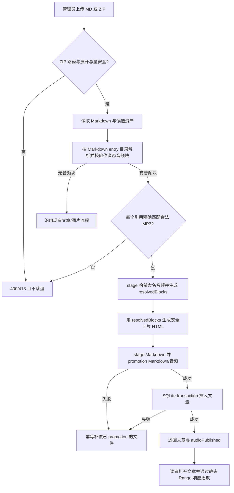

# 文章内音频播放 Design

## 0. 术语约定

| 术语 | 定义 | 防冲突结论 |
|---|---|---|
| 文章音频块（Article Audio Block） | Markdown 正文中的受控 `:::audio` 块，声明一张音频作品卡片 | 仓库当前没有 `audio` / `music` / `player` 概念，不与既有术语冲突 |
| 文章音频资产（Article Audio Asset） | 被文章音频块引用、随 ZIP 上传并归属于单篇文章的 MP3 文件 | 不等于独立歌曲实体，不建立歌曲表或作品库 |
| 发布音频路径 | `/audio/{article-slug}/{content-hash}.mp3` 形式的只读公开 URL | 原始 ZIP 路径只用于发布，不能直接进入最终 HTML |
| 文章发布包 | 当前 ZIP 文章上传格式的扩展：一份 Markdown、可选图片、可选被引用 MP3 | 沿用既有上传心智，不新增独立音频上传入口 |

## 1. 决策与约束

### 1.1 需求摘要

博主可以把歌曲与 Markdown、图片一起打成 ZIP。正文在指定位置出现一张作品卡片，读者使用浏览器原生控件播放、暂停、调整音量和拖动进度。

owner 已批准本能力愿景；requirement 保持 `draft` 表示能力尚未实现，验收通过后再升级为 `current`。

成功标准：上传包含合法音频块和 MP3 的 ZIP 后，文章正文显示安全、可访问的音频卡片；MP3 支持正常 GET/HEAD/Range 读取；普通文章保持原样。

明确不做：

- 不做全站悬浮播放器、跨页面续播或后台播放状态。
- 不做独立音乐作品集、歌曲表、播放列表、收藏或播放统计。
- 不做服务端转码、波形图、歌词同步、混音或音频编辑。
- 不做自定义 JavaScript 播放内核；播放交互交给原生 `<audio controls>`。
- 不允许 Markdown 原始 HTML，不接受站外音频 URL。
- 首版不提供音频块专用封面字段；封面继续使用紧邻音频块的普通 Markdown 图片。

### 1.2 复杂度档位

按生产 Web 服务默认档位推进，以下维度偏离默认组合：

- 性能 = reasonable：静态文件交给现有静态服务，不建设转码或流媒体服务；以单文件 20 MiB 和现有 50 MiB 上传包上限控制成本。
- 可观测性 = logged：单进程、本地文件系统流程只记录不含原始路径和内容的失败类别，不引入 tracing。
- 可读性 = team：这是博客内部代码和作者契约，不是对外 SDK；作者语法必须有 README 示例和稳定错误反馈。
- Compatibility = backward-compatible：不含音频块的现有 Markdown、图片 ZIP 和文章 HTML 行为必须保持不变。

### 1.3 关键决策

1. **受控 Markdown 块，而不是开放 HTML**
   作者契约为：

   ```markdown
   :::audio
   title: Stay Until Tomorrow
   artist: AI Bieber Experiment
   src: ./audio/stay-until-tomorrow.mp3
   caption: 最终混音版
   :::
   ```

   `title`、`src` 必填；`artist`、`caption` 可选。只接受这四个 key，重复或未知 key、未闭合块、空必填值都拒绝上传。`title` / `artist` 最长 120 个 Unicode code point，`caption` 最长 300 个；所有展示值按纯文本转义。

2. **首版只接收自托管 MP3**
   `src` 必须是 ZIP 内的相对路径，禁止 scheme、绝对路径、查询参数和片段。只接受 `.mp3`，并同时验证 MP3 文件签名；每个音频最多 20 MiB。候选“多格式 + 服务端转码”被拒绝，因为当前价值是发布已有成品，转码会引入媒体处理和兼容矩阵，不属于这项长期文章能力的核心逻辑。作者需要在发布前准备好 MP3。

3. **音频按文章隔离，不建数据库实体**
   音频以内容哈希命名并发布到文章 slug 子目录；同一文件在同一文章内只发布一次。文章删除时清理整个音频子目录。文章记录仍只保存重写后的 Markdown 与 HTML，不新增 schema 或迁移。

4. **原生播放控件 + 固定 DOM 作品卡片**
   每篇含音频的文章只输出一次固定样式链接，随后每个音频块输出以下语义结构；`N` 是文章内从 1 开始的稳定序号，所有文本和属性值都经过 HTML 转义：

   ```html
   <link rel="stylesheet" href="/css/article-audio.css?v=1" data-article-audio-styles>
   <figure class="article-audio">
     <figcaption class="article-audio__meta">
       <strong id="article-audio-title-N" class="article-audio__title">Stay Until Tomorrow</strong>
       <span class="article-audio__artist">AI Bieber Experiment</span>
     </figcaption>
     <audio class="article-audio__control" controls preload="metadata"
            aria-labelledby="article-audio-title-N"
            src="/audio/article-slug/sha256.mp3">
       <a href="/audio/article-slug/sha256.mp3">打开音频文件</a>
     </audio>
     <p class="article-audio__caption">最终混音版</p>
   </figure>
   ```

   `artist` / `caption` 缺失时省略对应元素；必须保留 `figure`、标题 id、`controls`、`preload="metadata"`、可访问关联和 fallback 链接；禁止 `autoplay`。固定样式链接由受信任渲染器生成，不允许作者覆盖 href。这样无需修改冻结的 EJS/header 或 `custom.css`。不新增播放器 JavaScript，键盘和媒体交互沿用浏览器原生行为；多张卡片相互独立，不做“同时只播放一首”的全局协调。

5. **严格失败，不发布残缺文章**
   音频块格式错误、引用缺失、格式/签名不符或超过限制时，整个上传失败且不写文章、Markdown 或公开音频。全部校验后，音频与规范化 Markdown 先写入临时路径，再按“Markdown → 音频目录”顺序原子 rename 到最终路径；任一步失败都幂等删除已 promotion 的本次资源。文件 promotion 全部成功后才在一个 SQLite transaction 中插入文章；transaction 失败时补偿删除 Markdown 与音频目录。DB commit 是最后一个持久化动作，之后只构造响应，不再执行会令上传失败的业务步骤。补偿可重复调用；补偿本身失败时返回脱敏 500 `article_publish_rollback_failed` 并记录安全 slug、阶段和失败类别，禁止伪报零残留。

6. **ZIP 展开前建立总量边界**
   保留现有 50 MiB 上传文件上限，并在解压前要求所有 ZIP entry 的声明展开大小总和不超过 100 MiB；超过时返回 413。该约束是接受媒体资产所必需的输入边界，同时覆盖既有图片 ZIP。

### 1.4 基线、依赖与证据计划

- 无新增第三方依赖；复用 `markdown-it` 的扩展接口、Node 内置文件/哈希能力、现有 `adm-zip` 与 Express 静态服务。
- 2026-07-17 基线：`npm test` 通过 80、跳过 1、失败 0；view hash 与 baseline manifest 校验通过；HTML snapshots 17/17 通过。
- `npm run test:visual` 在 120 秒窗口内未完成且没有返回测试失败信息，完整 `test:ejs-upgrade-gate` 因同一长耗时链路超时。实现阶段必须给该命令更长执行窗口，并把“命令完成”与“断言失败”区分。
- EJS 3.1.10 的 17/102/102 基线是升级历史证据，本 feature 不修改任何既有 EJS、`custom.css`、旧 hash manifest 或旧 snapshot。作品卡片由 Markdown 生成 HTML、自带固定新 stylesheet 链接；作者说明写入 README。新音频页面使用独立 Playwright scenario 和独立命令保存运行期截图，不向冻结 snapshot 目录写 expected 文件。

Top 3 风险与缓解：

1. **Markdown 元数据或路径造成持久化 XSS / 路径逃逸**：严格字段集合、纯文本转义、相对路径规范化、签名校验，并用恶意输入集成测试覆盖。
2. **文件系统与 SQLite 写入顺序造成孤儿文件或残缺文章**：先完成全部校验，再发布音频；后续失败按文章目录补偿清理；删除文章时安全解析 slug 后清理目录。
3. **桌面可播放但移动端无法 seek 或布局溢出**：验证 Content-Type、HEAD/Range 行为，并在桌面和手机视口保存真实浏览器证据。

非显然依赖：

- 现有 `express.static(public)` 必须继续提供音频 Content-Type 和 Range 响应；音频路径需要从访问统计采集入口显式排除。
- 当前上传先解析 Markdown、再分别替换图片路径；音频发布必须避免依赖易碎的最终 HTML 字符串替换。

关键假设：

- 待发布歌曲可以准备为不超过 20 MiB 的 MP3。
- 原生音频控件满足首版视觉与交互要求，无需统一不同浏览器的控件外观。
- 首版不需要把封面合并进音频卡片；普通 Markdown 图片足以承载封面。
- ZIP 中的音频路径以 Markdown entry 所在目录为基准，作者可以保持文章目录内的相对组织。

清洁度：不得留下调试输出、临时 TODO/FIXME、注释掉代码、未引用依赖、真实歌曲测试文件或泄漏本地绝对路径的错误信息。

## 2. 名词与编排

### 2.1 名词层

#### 现状

- `server/utils/markdown.js` 的 `parseMarkdown` 使用 `markdown-it` 生成 HTML，并保持 `html: false`；只识别普通 Markdown 图片引用。
- `server/routes/admin.js` 的上传接口只收 `.md` / `.zip`，ZIP 资产只有图片；响应里的文章摘要包含 `imagesConverted`。
- `server/config.js` 只有临时上传目录、图片目录和文章目录；`public` 由 `server/index.js` 统一静态托管。
- SQLite `articles.content` / `articles.html` 是文章内容的唯一持久化表示，没有通用附件实体。

#### 变化

新增作者态与解析后发布态，禁止用同一个 `src` 类型混合两个信任级别：

```text
AuthorAudioSource = RelativeZipPath
PublishedAudioSource = /audio/{safe-slug}/{64-char-lowercase-sha256}.mp3

ArticleAudioBlock {
  title: string          // 1..120 code points
  artist?: string        // 1..120 code points
  src: AuthorAudioSource // 以 Markdown entry 所在目录为基准
  caption?: string       // 1..300 code points
}

ResolvedArticleAudioBlock = ArticleAudioBlock - src + {
  src: PublishedAudioSource
}
```

ZIP 路径契约：`/` 是唯一分隔符，反斜杠拒绝；先以 `markdownEntryName` 的目录为基准解析 `.` / `..`，规范化后不得越过 ZIP 根；匹配区分大小写；百分号序列按字面字符处理、不做 URL decode；两个 entry 若规范化为同一路径则整个包以 `audio_archive_ambiguous` 拒绝。单独 `.md` 里的音频块没有资产上下文，返回 `audio_archive_required`。

新增文章音频资产准备接口。调用方提供最终安全 slug、Markdown entry 名、解析后的作者态 blocks、ZIP entry 视图和临时/公开根目录；接口负责路径解析、精确匹配、验证、去重、stage、promotion 与幂等补偿：

```text
prepareArticleAudioAssets(input)
  -> {
       resolvedBlocks: ResolvedArticleAudioBlock[],
       publishedCount: number,
       promote(): Promise<void>,   // 幂等；只把已验证 stage 原子移到最终目录
       rollback(): Promise<void>   // 幂等；可在部分 promotion 后重复调用
     }
  -> ArticleAudioInputError(status, code, safeMessage)

// 来源：server/routes/admin.js POST /upload 当前文章上传编排
```

Markdown 解析拆成“文档/音频块解析”和“带 resolvedBlocks 的最终渲染”两个阶段。作者态 `src` 永远不直接渲染；最终 HTML 只消费 `ResolvedArticleAudioBlock`。`articles.content` 与保存的 Markdown 保留作者态相对 `src`（图片仍沿用既有路径重写），`articles.html` 保存解析后发布态 URL；不会把 `/audio/...` 再喂回作者态解析器，也不做音频 HTML 字符串替换。

MP3 与命名 invariant：

- 文件必须非空且不超过 20 MiB。
- 允许可选 ID3v2 header；在跳过其合法 synchsafe 长度后，前 64 KiB 内必须找到至少两个位置连续的完整 MPEG audio frame：每个 frame 的 version/layer/bitrate/sample-rate 不能是 reserved/invalid，按 header 计算的 frame 长度必须落在文件边界内，第二个 frame 必须从第一个计算出的结束位置开始。只含 ID3、单个/残缺 header 或随机 frame-sync 字节不算合法。
- 对完整文件计算 SHA-256，使用 64 个小写十六进制字符作为文件名。先写临时文件再原子 rename；目标已存在时重新核对 size + SHA-256，一致则复用，不一致返回脱敏 500，不覆盖已有文件。

稳定错误 code：

| HTTP | code | 场景 |
|---|---|---|
| 400 | `audio_block_invalid` | 块结构、字段或长度无效 |
| 400 | `audio_archive_required` | 单独 `.md` 含音频块 |
| 400 | `audio_path_invalid` | 绝对、反斜杠、越界或不合法相对路径 |
| 400 | `audio_archive_ambiguous` | 规范化 ZIP 路径重复 |
| 400 | `audio_asset_missing` | 引用不存在或大小写不一致 |
| 400 | `audio_format_unsupported` | 非 `.mp3` |
| 400 | `audio_content_invalid` | 空文件或不满足首版 MPEG/ID3 规则 |
| 413 | `audio_asset_too_large` | 单音频超过 20 MiB |
| 413 | `archive_expanded_too_large` | ZIP 声明展开总量超过 100 MiB |
| 500 | `audio_publish_failed` | stage/promotion/存储失败，响应不含内部错误原文 |
| 500 | `article_publish_rollback_failed` | 失败后的幂等补偿未完成 |

上传成功响应保持现有字段，并新增计数：

```json
{
  "success": true,
  "article": {
    "id": 42,
    "title": "一次 AI 歌曲实验",
    "slug": "ai-song-experiment",
    "tags": ["AI", "音乐"],
    "imagesConverted": 1,
    "audioPublished": 1
  }
}
```

音频输入错误保持现有 `error` 可读文本，同时增加稳定 `code`；格式类返回 400，大小类返回 413。未知存储/数据库异常仍返回 500，但不得把本地路径或内部异常原文写入响应。

##### Interface 设计检查

- Module：新增“文章音频资产”内部模块；Markdown 音频块解析/渲染是其作者契约入口，上传路由只编排。
- Interface：调用方提供最终安全 slug、`markdownEntryName`、解析后的作者态 blocks、ZIP entry 视图和临时/公开根目录；不知道路径规范化、MP3 frame/SHA-256 细节或文章音频目录内部布局。
- Seam：上传路由与 Markdown 渲染器之间的进程内 seam；测试可用内存 ZIP entry 和临时目录穿过同一接口。
- Depth / locality：路径校验、大小/frame 校验、哈希、去重、音频 stage/promotion 与音频资源幂等 rollback 集中在模块内部；上传编排只负责跨 Markdown、音频和 SQLite 的顺序。删除模块后这些复杂度会散回路由和 Markdown 工具，因此不是 pass-through。
- Dependency strategy：local-substitutable，本地文件系统可由临时目录替换；不为单一实现额外造 adapter 层。
- Adapter：无；直接注入根目录/文件操作边界即可测试，不建立 production/test 双 adapter。
- Test surface：音频块解析、ZIP 匹配、错误码、最终公开路径、补偿清理和重复引用去重均可从接口输出和临时文件系统观察。

### 2.2 编排层



#### 现状

当前上传是线性 pipeline：保存临时上传 → 解压/读 Markdown → `parseMarkdown` → 图片匹配与 WebP 转换 → 替换 Markdown/HTML 图片路径 → 写 SQLite 和 Markdown → 清理临时文件。文章删除先删数据库，再异步删 Markdown。

#### 变化

- ZIP entry 安全检查后、正式解压前增加声明展开总量 gate。
- 读取 Markdown 时保留 `markdownEntryName`。音频 `src` 以该 entry 的目录为基准规范化，使用完整、区分大小写的 ZIP entry 路径精确匹配，不复用图片当前的 basename 模糊匹配。
- 所有音频块和文件通过验证后，先在临时目录生成去重 MP3 和 `ResolvedArticleAudioBlock`；最终 HTML 直接消费 resolved blocks，作者态 `src` 不进入 HTML，也不做音频 HTML 字符串替换。
- 规范化 Markdown 和音频都先 stage；promotion 过程中任一步失败，幂等 rollback 删除本轮已移动资源。promotion 全部成功后才执行 SQLite transaction；transaction 失败再次 rollback。DB commit 后不再安排可能改变成功状态的持久化动作。
- 删除文章后追加该 slug 音频目录的 best-effort 清理；清理失败记录安全日志，不恢复已删除数据库记录。
- `/audio` 路径加入统计采集排除项；静态服务继续作为唯一读取入口，不新增音频 API。

流程级约束：

- **错误语义**：作者可修复的块/路径/格式错误返回稳定 400 code；大小边界返回稳定 413 code；内部失败返回脱敏 500。rollback 失败不得伪报“零残留”。
- **幂等与去重**：同一上传包内相同音频内容只写一次；重复上传文章仍沿用现有 slug 去重规则，音频目录使用最终 slug。
- **顺序**：必须先得到最终安全 slug、`markdownEntryName` 和全部输入校验结果，再 stage/promotion；promotion 顺序固定为 Markdown 后音频目录，DB transaction 最后 commit。`promote` / `rollback` 都必须可重复调用。
- **并发**：内容哈希文件名避免同文章内重复写；不同最终 slug 使用独立目录。首版不承诺覆盖同 slug 的并发更新，因为现有流程会生成新 slug。
- **可观测性**：日志只记录错误 code、文章 id/安全 slug 和阶段，不记录音频元数据、原始本地路径或文件内容。
- **静态读取**：MP3 响应必须是 `audio/mpeg`，支持 HEAD 和字节 Range；播放器不得依赖一次性加载完整文件。

### 2.3 挂载点清单

1. Markdown 作者契约：`:::audio` 块 — 新增。
2. 管理员文章上传入口：`POST /api/admin/upload` — 扩展 ZIP 资产编排与成功/错误响应。
3. 公开静态命名空间：`/audio/{article-slug}/{content-hash}.mp3` — 新增。
4. 公共页面样式入口：含音频文章的生成 HTML 在第一张卡片前插入一次固定 `/css/article-audio.css?v=1` 链接 — 新增；既有 EJS/header 与 `custom.css` 不修改。

删除清理、内部解析函数、哈希工具和测试 fixture 是内部实现，不列为挂载点。

### 2.4 推进策略

1. 作者契约与 DOM：作者态音频块解析为值对象，resolved block 生成固定安全 DOM，普通 Markdown 零变化。
   退出信号：合法、恶意、不完整和单 `.md` 示例分别得到契约规定的 DOM 或稳定错误。
2. ZIP 路径边界：保留 `markdownEntryName`，完成相对基准、规范化、重复 entry 和展开总量校验。
   退出信号：根/子目录、`.` / `..`、大小写、反斜杠、百分号字面值和重复规范路径都有 yes/no 断言。
3. MP3 资产节点：完成非空/大小、ID3/MPEG frame、SHA-256、stage 与同内容去重。
   退出信号：合成最小合法 MP3 fixture 稳定 stage；伪造、超限和冲突目标不覆盖公开文件。
4. 发布 transaction：接通 HTML、Markdown stage、文件 promotion、SQLite transaction、成功计数和幂等补偿。
   退出信号：真实 ZIP 端到端落盘；对每个注入失败阶段，DB row、Markdown 和音频满足补偿契约。
5. 文章生命周期与静态读取：接通文章删除清理、Content-Type/HEAD/Range 和访问统计排除。
   退出信号：删除后 URL 404；合法 Range 返回部分内容且不产生页面访问记录。
6. UI 与作者说明：新增独立音频 stylesheet 和 README 发布包示例，不修改冻结 EJS / `custom.css`。
   退出信号：作者能按 README 组成发布包，桌面/手机无溢出，原生控件可键盘操作且不存在 autoplay。
7. 自动化回归：补齐正常、边界、安全、旧 Markdown/图片流程和清洁度断言。
   退出信号：SC-01 至 SC-09、SC-11 由 `npm test` 证明，无真实歌曲 fixture 或路径泄漏。
8. 浏览器与冻结基线证明：运行独立音频 Playwright scenario，并证明历史 EJS 基线零改动。
   退出信号：SC-10 有运行期桌面/手机截图，独立浏览器命令与历史 upgrade gate 均完成。

### 2.5 结构健康度与微重构

#### 评估

- 文件级 — `server/routes/admin.js`：305 行，承担上传/列表/删除三个管理路由；本 feature 会触碰上传和删除，但核心音频计算放新模块，路由只增加发布 transaction 编排，不继续堆入解析/哈希/文件校验。
- 文件级 — `server/utils/markdown.js`：155 行，职责仍是 Markdown 解析与渲染；音频块扩展属于同一职责，可通过独立插件/解析单元接入。
- 文件级 — `public/css/custom.css`：866 行，已超过健康度触发线；本 feature 不继续追加音频样式，改用独立文章音频样式文件。
- 文件级 — 既有 EJS/header：被冻结的 EJS 3.1.10 升级证据面，本 feature 不修改；样式链接由受信任文章渲染器按需生成一次。
- 目录级 — `server/utils/` 当前 4 个同层文件，本次新增音频职责文件后仍未摊平；`public/css/` 当前只有 1 个文件，新增 1 个专用样式文件不会造成摊平。
- compound 未命中目录、命名或音频相关既有 convention。

#### 结论：不做微重构

不搬动现有行为。通过“新音频逻辑落新模块、音频样式落新文件、旧路由保持薄编排、冻结 EJS 零改动”避免继续放大胖文件或破坏历史基线；这些新增属于 feature 主体，不是前置重构。

## 3. 验收契约

### 3.1 关键场景清单

| ID | 输入 / 触发 | 期望可观察结果 |
|---|---|---|
| SC-01 | 上传包含合法 Markdown、图片和一个被引用 MP3 的 ZIP | 返回 200，文章保存，`audioPublished = 1`，正文显示标题/作者/说明和原生播放器 |
| SC-02 | 同一文章重复引用同一 MP3，或引用两个不同 MP3 | 相同内容只 stage/publish 一次；不同内容各自发布，所有卡片引用文章专属 64 个小写十六进制字符 SHA-256 URL |
| SC-03 | 上传不含音频块的现有 `.md` 或图片 ZIP | 状态码、图片转换、文章内容和既有响应字段保持不变，`audioPublished = 0` |
| SC-04 | 音频块未闭合、缺少 title/src、出现重复/未知 key 或字段超长 | 返回 400 和稳定 code；数据库、文章文件和公开音频均无新增 |
| SC-05 | Markdown 位于 ZIP 根或子目录，src 使用正常相对路径、`.` / `..`、大小写差异、反斜杠、百分号字面值、逃逸路径或规范化重复 entry | 只按 Markdown entry 目录、`/` 分隔符、区分大小写的规则匹配；歧义/越界返回稳定 400，不泄漏服务器路径 |
| SC-06 | 引用非 `.mp3`、空文件、只有 ID3、只有一个合法 header/frame、非连续伪造 frame、单文件超过 20 MiB，或 ZIP 声明展开总量超过 100 MiB | 只有至少两个位置连续的完整合法 MPEG frame 才通过；格式/内容错误返回 400，大小错误返回 413；stage/公开目录无残留 |
| SC-07 | 注入 HTML、引号、事件属性或脚本样式的 title/artist/caption | 最终 HTML 仅出现转义后的纯文本；Markdown 原始 HTML 仍被转义 |
| SC-08 | 请求已发布 MP3 的 GET、HEAD 和合法 Range | Content-Type 为 `audio/mpeg`；HEAD 可用；Range 返回部分内容响应，且不产生页面访问统计 |
| SC-09 | 在 Markdown promotion、音频 promotion、SQLite transaction 分别注入失败；另模拟 rollback 自身失败；随后删除一个成功发布的音频文章 | 普通失败经幂等 rollback 后无 DB row、Markdown 或音频；rollback 失败返回专用脱敏 500 且不伪报零残留；成功文章删除后 URL 404 |
| SC-10 | 在桌面和手机视口打开音频文章，用鼠标和键盘操作 | 卡片无横向溢出，控件可聚焦/播放/暂停/seek；HTML 无 `autoplay`，初始 `preload="metadata"` |
| SC-11 | 上传包含音频块的单独 `.md`，没有 ZIP 资产上下文 | 返回 400 `audio_archive_required`，不保存文章、Markdown 或音频 |

### 3.2 明确不做的反向核对项

- 不新增歌曲/播放列表数据库表、迁移、音乐列表路由或后台导航入口。
- 不新增全局播放器 DOM、播放状态脚本、Service Worker 或跨页面续播代码。
- 不新增 ffmpeg、媒体转码依赖、波形/歌词/收藏/统计实现。
- 不把 `html: false` 改为 true，不接受 `http:` / `https:` / `data:` 音频源。
- 不生成 `autoplay`，不用 `controlsList="nodownload"` 宣称无法下载公开资源。
- 不把音频专用样式继续塞进现有 866 行 `custom.css`。
- 不修改既有 EJS、`view-style-manifest.json`、EJS 3.1.10 baseline manifest 或冻结 snapshots；新浏览器证据只写运行期结果目录。

### 3.3 Acceptance Coverage Matrix

| Scenario | Covered By Step | Evidence Type | Command / Action | Core? |
|---|---|---|---|---|
| SC-01/SC-02 发布与去重 | S1/S3/S4 | integration test + filesystem diff | `npm test` | yes |
| SC-03 既有流程兼容 | S4/S7 | regression test | `npm test` | yes |
| SC-04/SC-07/SC-11 块、XSS、单文件边界 | S1/S7 | unit + HTTP integration | `npm test` | yes |
| SC-05 ZIP 路径契约 | S2/S7 | table-driven unit + ZIP integration | `npm test` | yes |
| SC-06 MP3/大小契约 | S2/S3/S7 | synthetic fixture + filesystem assertion | `npm test` | yes |
| SC-08 静态读取与统计排除 | S5/S7 | HTTP response assertions | `npm test` | yes |
| SC-09 transaction/补偿/删除 | S4/S5/S7 | failure-injection integration + filesystem assertion | `npm test` | yes |
| SC-10 桌面/手机/键盘 | S6/S8 | 独立 Playwright + runtime screenshots | `npm run test:article-audio-browser` | yes |
| 冻结 EJS 历史证据零改动 | S8 | immutable hash/snapshot gate | `npm run test:ejs-upgrade-gate` | yes |
| §3.2 范围守护 | S7/S8 | diff review + dependency/schema grep | `git diff` / `npm ls --depth=0` | yes |

### 3.4 DoD Contract

| ID | 要求 | 证据 | 阻塞级别 |
|---|---|---|---|
| DOD-DESIGN-001 | design 与 checklist 覆盖全部已确认边界且独立 design review passed | design-review 报告 | blocking |
| DOD-IMPL-001 | S1-S8 完成，每步退出信号有可复查证据 | checklist + 实现证据 | blocking |
| DOD-REVIEW-001 | 独立 code review passed 且无 unresolved blocking finding | review 报告 | blocking |
| DOD-QA-001 | Standard accept-inline 跑完核心命令、HTTP 和浏览器场景；无需独立 QA 报告 | 命令输出 + API 响应 + 截图 | blocking |
| DOD-ACCEPT-001 | requirement 升为 current，架构文档反映文章音频管线，交付物与清洁度审计通过 | acceptance 报告 + diff | blocking |

Validation Commands：

| ID | 命令 | 目的 | 核心性 | 失败处理 |
|---|---|---|---|---|
| CMD-001 | `npm test` | 单元、HTTP、文件系统、安全和兼容回归 | core | fix-or-block |
| CMD-002 | `npm run test:article-audio-browser` | 独立音频文章桌面/手机 DOM、布局、键盘和运行期截图 | core | fix-or-block |
| CMD-003 | `npm run test:ejs-upgrade-gate` | 证明冻结 EJS/hash/snapshot 历史证据零改动 | core | fix-or-block；给 visual 阶段至少 300 秒且禁止更新旧 expected |
| CMD-004 | `npm ls --depth=0` | 证明依赖树完整且没有为播放器新增非必要依赖 | supporting | fix-or-block |

Required Artifacts：design-review、code review、acceptance、命令输出、音频 HTTP 响应证据、独立音频 scenario 的桌面与手机运行期截图、冻结基线零 diff 证据、diff summary。

交付物类别：安全音频块契约、文章音频资产模块、上传/删除生命周期接入、公开音频命名空间、作品卡片样式、README 作者说明、独立浏览器 scenario、自动化证据、requirement/architecture 状态同步。

## 4. 与项目级架构文档的关系

这是系统级可见的新文章内容类型。acceptance 阶段需要把以下现状提炼到 `.codestable/architecture/ARCHITECTURE.md`：

- 文章发布管线支持 Markdown、图片和文章专属 MP3 资产。
- `ArticleAudioBlock` 是受控作者契约；原始 HTML 继续禁用。
- 公开音频按文章 slug 隔离、由静态服务读取、随文章删除清理。
- 不存在歌曲实体、音乐子系统或独立音频 API。

对应 requirement `article-audio-playback` 在验收通过后从 `draft` 更新为 `current`。当前不新增 CONTEXT 术语表或数据库架构；若未来第二个内容入口也复用音频资产，再评估是否提升为通用媒体子系统和 ADR。
